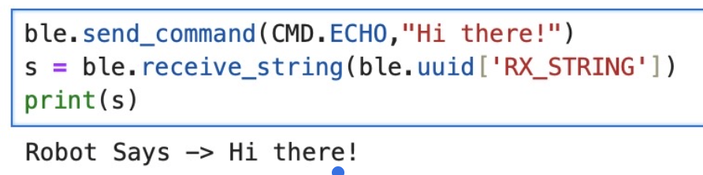
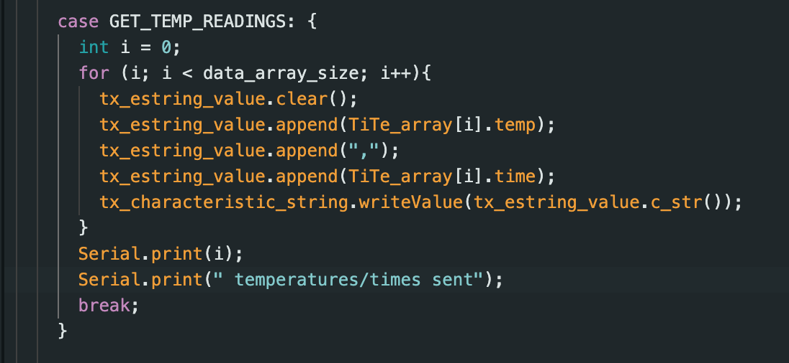
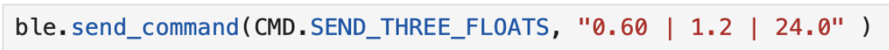
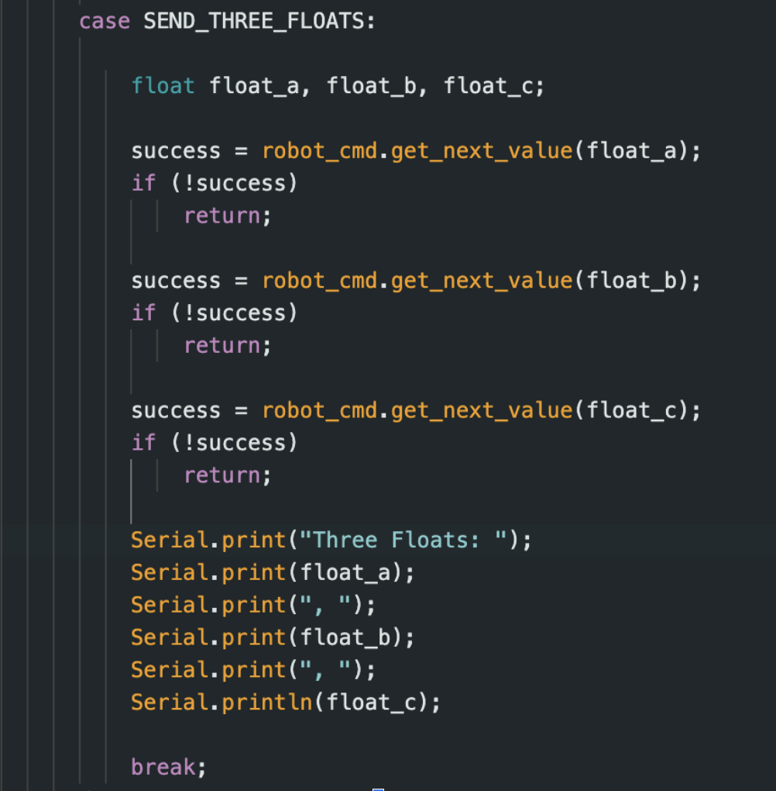
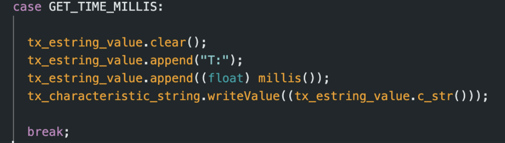
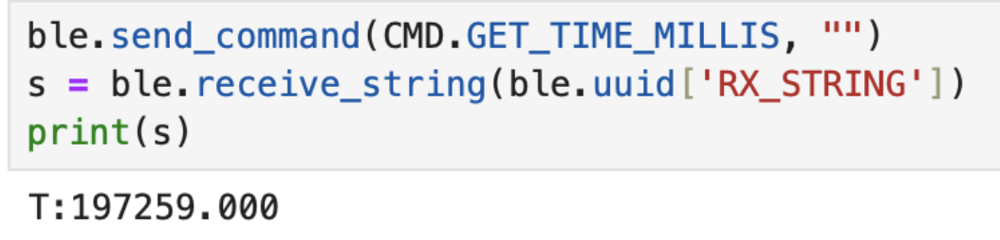
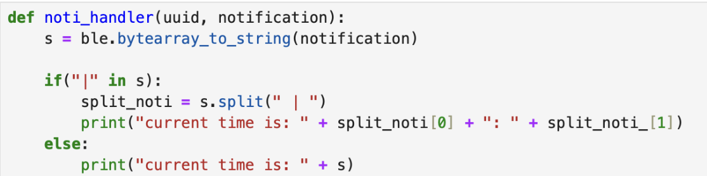
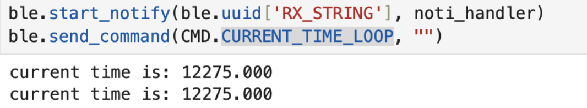
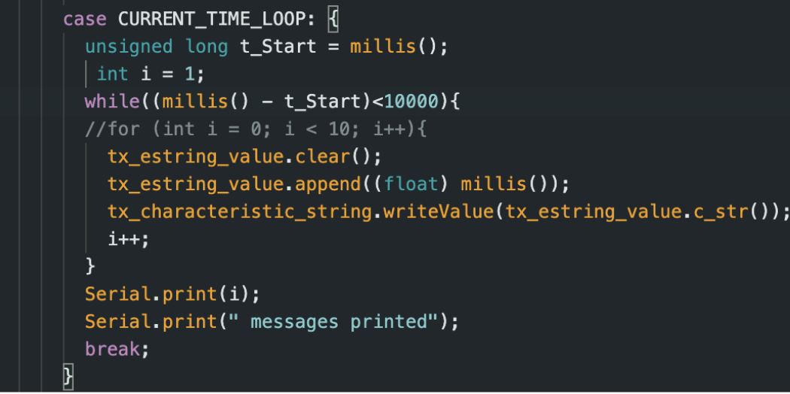

+++
title = "Lab 1"
description = "Connecting Bluetooth to the Nano"
date  = 2025-01-31
+++

> Lab1: The Artemis Board and BlueTooth


## Prelab
Before starting the lab we had to setup our computers in order for us to work with the Adruino. Doing this requrired us downloading the **Arduino IDE**. Luckily for me even though I have a Mac, I haven't updated it in years, so I don't have to download any additional drivers. Getting that out of the way, next I had to setup my environemnt in Python in order to send and recieve messages from the ardruino, Having Pip and Python latest versions already installed all I had to do was download the virtual environment (activate it), downlaod the necessary python packages, the codebase, and Jupyter Notebook. 


```python
source FastRobots_ble/bin/activate
pip install numpy pyyaml colorama nest_asyncio leak jupyterlab
```

The codebase we are working in is ble_arduino where it has the files ble_arduino.ino, BLECstringCharacteristic.h, EString.h, RobotCommand.h which to sum up do: 

**RobotCommand.h**
 - Used when Artemes recieves string format of 
```python
<cmd_type>:<value1>|<value2>...
```
- robot_cmd(:|) whrere ":l" is deilmiter 
- <cmd_type> is an int and <value> can be either an int, float, string 
- Main way we will by sending commands in jupyter notebook

**EString.h.h**
- Used to manipulate char arrays
- provides getter and setter functions 
- Clear(), append(), c_str(), are all used throuhgout to send charracter arrays. 
- Used to transmit strings from the Artemis to the computer (main way we recieve data in lab)

**BLECstringCharacteristic.h**
- Use to receive data from the artemis 
- writeValue(value): the value is what we transmit to the computer 

**ble_arduino.ino**
- Main file we will be editing and connecting though our Artemis wth BLE 
- Contains our UUIDS (University unique identifiers) 

Furthermore, we had to configure ble_arduino such that we print our unique MAC_ADDRESS and create a new UUID. This is to make sure that we only connect to our device and not the rest of the students in the lab. Changing this in our ble_arduino.ino and Juptyer Notebook, now allowed us to our tasks. 

# Tasks

**1. ECHO**

The first command we implemented was ECHO. This just ment that we would send a string to our Artemis and it will reply with "Robot says -> string sent". 




The above image showcases how we clear our char array and then append "Robot says", with the next line adding our message then sending that whole char array back to us. With the other image showing what we receive. 

**2. SEND_THREE_FLOATS**



Next we had to send three floats to the Artemis, and it had to extract each individual value. Knowing that | seperates values, we send three floats with | in between, and with the .get_next_value cmd we can seperate each one simply. 



**3. GET_TIME_MILLIS**

Next, we implement a command to fetch time in ms. Like earlier we will simply use the function millis(), andn append it into a character array with T:. 




**4. Notifciation Handler**

We then setup a notifcation handler, where it will receive the stringss from the Artemis board sends, and then configure it to split the data so we can use it. This is down by using .split, and then later we append them to lists. 



Here it is being used to print out time in ms automatically for us. 



**5. Time Loop**



Now we need to create a loop that sends out current time in ms. Using our functions from before, we simply create a while loop with us looping until we hit 10000. I used 10000 because, 10000/1000 = 10 seconds which is a very nice number to divide with. Incrementing int i to know how many messages are sent, at the end we were able to send 500 messages in 10 seconds. Which means ~ 50 msgs/s. The size of the char array I sent was 9, meaning 9 bytes per message so 450 bytes per message is the data transfer rate i got. 

**5. Time Loop**


