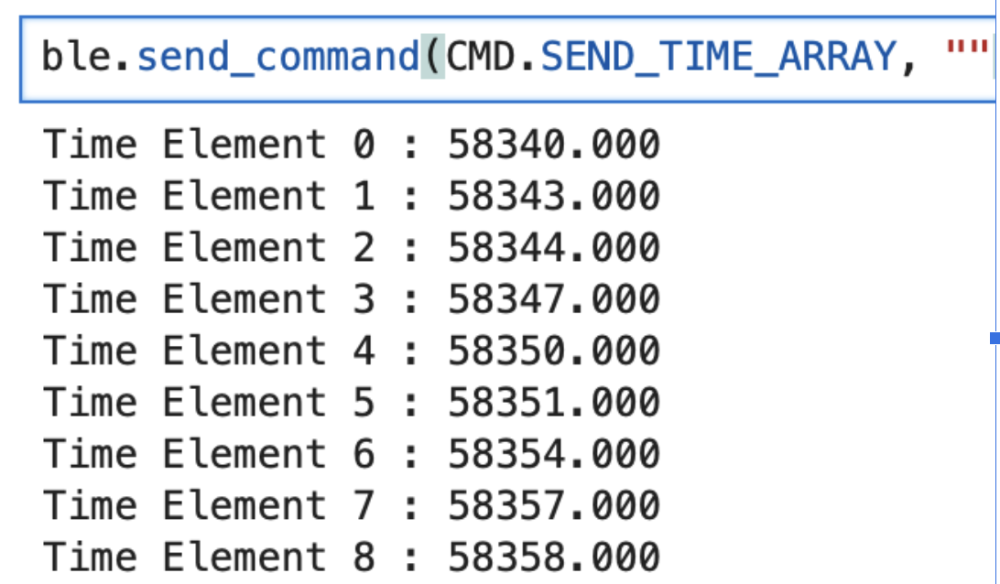

+++
title = "Lab 1"
description = "Connecting Bluetooth to the Nano"
date  = 2025-01-31
+++

> Lab1: The Artemis Board and BlueTooth


## Prelab
Before starting the lab we had to setup our computers in order for us to work with the Adruino. Doing this requrired us downloading the **Arduino IDE**. Luckily for me even though I have a Mac, I haven't updated it in years, so I don't have to download any additional drivers. Getting that out of the way, next I had to setup my environemnt in Python in order to send and recieve messages from the ardruino, Having Pip and Python latest versions already installed all I had to do was download the virtual environment (activate it), downlaod the necessary python packages, the codebase, and Jupyter Notebook. 


```python
source FastRobots_ble/bin/activate
pip install numpy pyyaml colorama nest_asyncio leak jupyterlab
```

The codebase we are working in is ble_arduino where it has the files ble_arduino.ino, BLECstringCharacteristic.h, EString.h, RobotCommand.h which to sum up do: 

**RobotCommand.h**
 - Used when Artemes recieves string format of 
```python
<cmd_type>:<value1>|<value2>...
```
- robot_cmd(:|) whrere ":l" is deilmiter 
- <cmd_type> is an int and <value> can be either an int, float, string 
- Main way we will by sending commands in jupyter notebook

**EString.h.h**
- Used to manipulate char arrays
- provides getter and setter functions 
- Clear(), append(), c_str(), are all used throuhgout to send charracter arrays. 
- Used to transmit strings from the Artemis to the computer (main way we recieve data in lab)

**BLECstringCharacteristic.h**
- Use to receive data from the artemis 
- writeValue(value): the value is what we transmit to the computer 

**ble_arduino.ino**
- Main file we will be editing and connecting though our Artemis wth BLE 
- Contains our UUIDS (University unique identifiers) 

Furthermore, we had to configure ble_arduino such that we print our unique MAC_ADDRESS and create a new UUID. This is to make sure that we only connect to our device and not the rest of the students in the lab. Changing this in our ble_arduino.ino and Juptyer Notebook, now allowed us to our tasks. 

# Tasks

# Lab 1A
The first lab we look into the examples given in the Ardruino library to test out our Artemis capabilities.

## **1. Blink**

[](https://youtu.be/SVlN_UHRQ4E)

The first example we tested was blinking an LED, as shown above and here is where I configured my Baud rate to 115200 in order to properly work.

## **2. Serial Monitor**

[](https://youtu.be/361qbpHtpAU)

Next, we opened over the serial monitor and making sure the baud is right we are able to type messages inside of it as shown in the video. 

## **3. Temperature Sensor**

[](https://youtu.be/bMS_tNvHVv4)

Here we test our temperature sensor, by placing our finger on top of it and seeing the it rise and fall as we move it off/on it. 

## **4. Microphone**

[](https://youtu.be/9v8sVgSSDyg)

Lastly, we test to see if our microphone is working by checking if there is a change in frequency due to sound. As seen in the video I attempted to whistle, and there was some change, so I'll take it. 


# Lab 1B 

## **1. ECHO**

The first command we implemented was ECHO. This just ment that we would send a string to our Artemis and it will reply with "Robot says -> string sent". 


The above image showcases how we clear our char array and then append "Robot says", with the next line adding our message then sending that whole char array back to us. With the other image showing what we receive. 

## **2. SEND_THREE_FLOATS**


Next we had to send three floats to the Artemis, and it had to extract each individual value. Knowing that | seperates values, we send three floats with | in between, and with the .get_next_value cmd we can seperate each one simply. 


## **3. GET_TIME_MILLIS**

Next, we implement a command to fetch time in ms. Like earlier we will simply use the function millis(), andn append it into a character array with T:. 


## **4. Notifciation Handler**

We then setup a notifcation handler, where it will receive the stringss from the Artemis board sends, and then configure it to split the data so we can use it. This is down by using .split, and then later we append them to lists. 


Here it is being used to print out time in ms automatically for us. 


## **5. Time Loop**


Now we need to create a loop that sends out current time in ms. Using our functions from before, we simply create a while loop with us looping until we hit 10000. I used 10000 because, 10000/1000 = 10 seconds which is a very nice number to divide with. Incrementing int i to know how many messages are sent, at the end we were able to send 500 messages in 10 seconds. Which means ~ 50 msgs/s. The size of the char array I sent was 9, meaning 9 bytes per message so 450 bytes per message is the data transfer rate i got. 

## **6. Time Array**

With creating a time loop, now we need to store these times into an array. To do this first you have to create a global variables:
```python
const int data_array_size = 1000;
int Time_array[data_array_size];
```
I choose to gather 1000 max samples of time so I don't take to long sending/gathering data. Next simply we just createa a foor loop that iterating thorugh the array as shown below. 


Next to send a data, we just create a similar loop, but this time instead of placing values into our array we read our time_array values using a for loop. Then like before we appendn them as character arrays and send that message to the computer.


Here what we see on our side when we call it (Using the notificatoin handler)



## **7. Time and Temp Array**
Now, we have to integrate getting temperature at the same tie as getting our time stamps. Using a similar method of creating an array, and then looping thorugh it as we did time we have as shown below with the same array size. Using millis() to get time and getTempDegF() to get temperature. 

```python
int Temp_array[data_array_size];
```


After creating our array, we use the same method as time, we just append our temperature to the char array and send it to the computer. 


This is what it looks like from our side when we call the command!

## **8. Pros/Cons **

The two methods we explore is sending data while collecting it (live), and gathering the data into a array, and then sending the array. When it comes to having a large amount of data that you want to send it is best to gather it an array since you will collect way more data in a given time. Experimenting with sending data and then sending, if you do it in a for loop it will take signficianlty longer. The for loop has to iterate through to gather each data, and then send the data in char arrarys to the computer which take ages. However, if you just append all the data into an array and have a seperate command to send it then you won't face that time hold up! Meaning if you want more data per second, and you want to gather a lot then use an array first then send it. However, if you're only looking at a few values then doing it live won't cause to much time delay. It better to do live sending when first implementing functions/sensors to make sure they're operating properly. However, once you know they are set up correct, then I would switch out the send statements so you can gather more data. 

## **Discussion**
In this lab I wanted to experiment with typedef struct, which can be seen above when I was gather Temp and Time. I thought that maybe, this would save me some time and be easier, however, I was completely wrong. It felt way more complicated using my own type, instead of simply using creating another array, which trust me I learned for future labs. I also tinkered with how much bytes a message could send and if that would affect its msg rate. I went up to 15 bytes of data per msg and didn't see to much of a change from the orignal, however,i didn't limit test it as I would've liked to. Which makes me wonder what is the max for it, which I feel like I'll find out bby mistake. 


