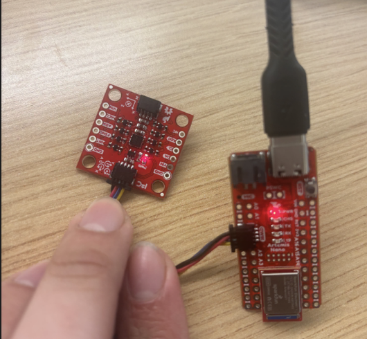
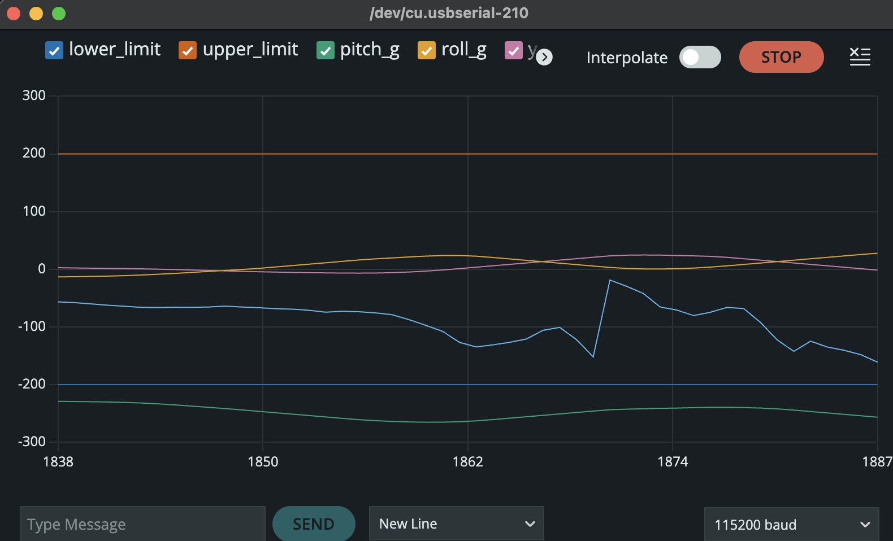
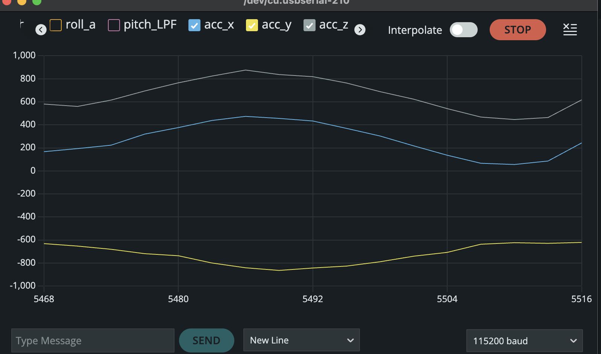
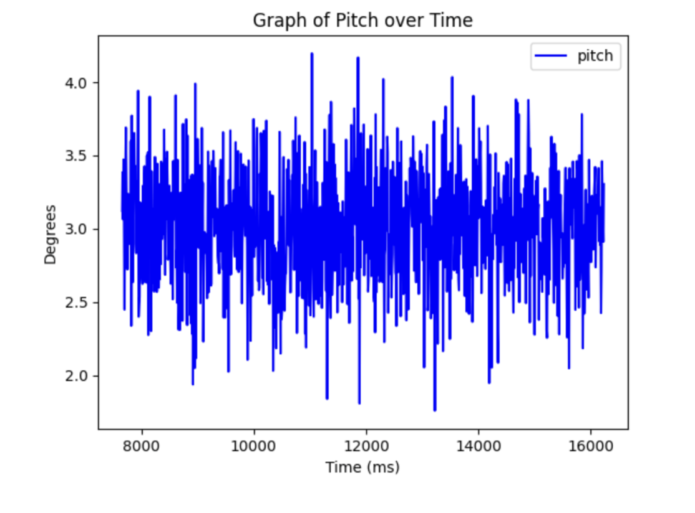
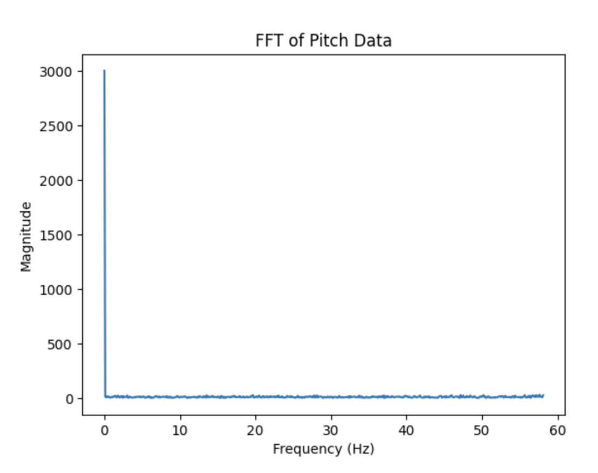
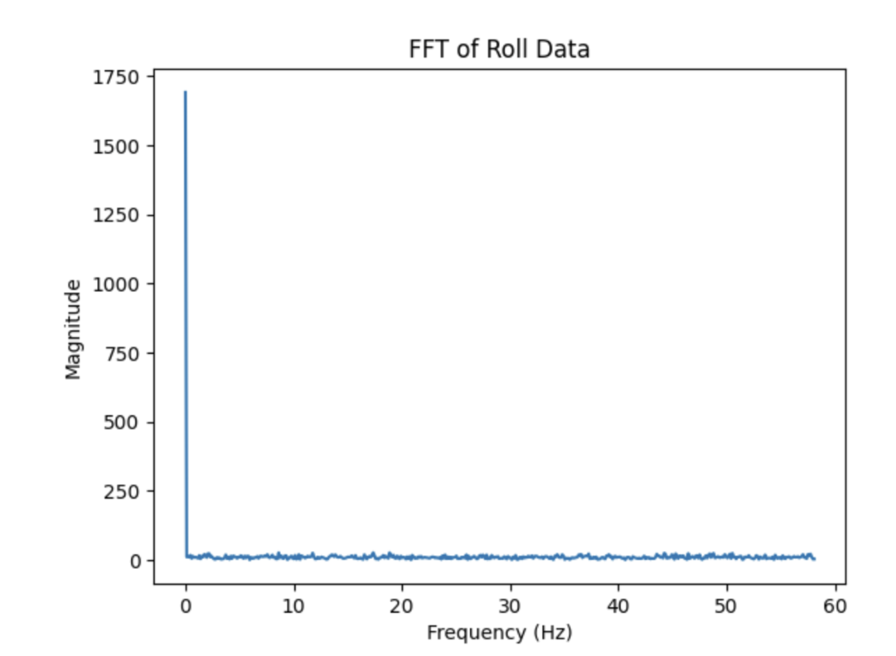
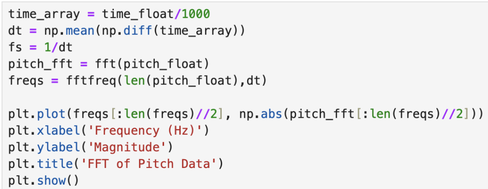
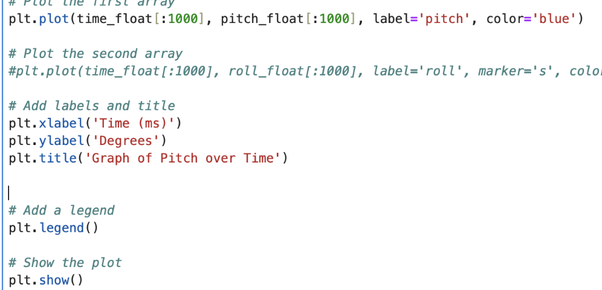
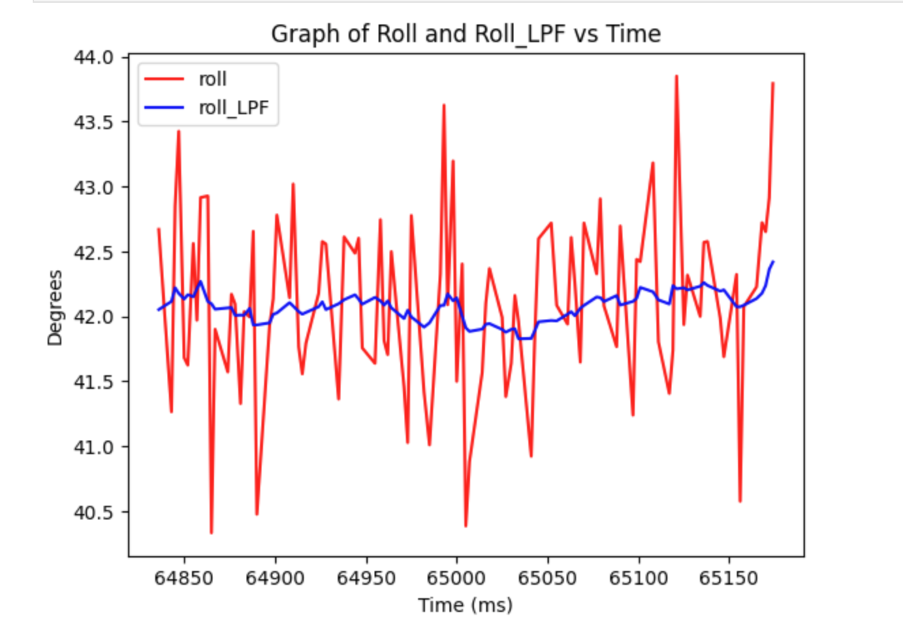
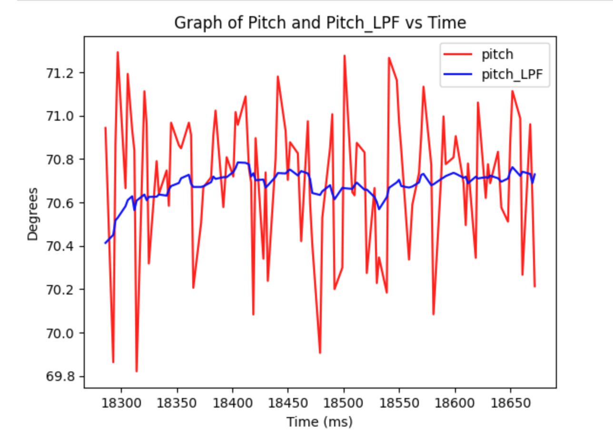

+++
title = "Lab 2"
description = "IMU"
date  = 2025-01-31
+++

> Lab2: Here we are working with the IMU so we can add it to our robot. Experimenting gathering data with the accelerometer and gyroscope, plus making a stunt with our RC robot. 


# Tasks

# Lab 2
The first lab we look into the examples given in the Ardruino library to test out our Artemis capabilities.

## **1. Setting Up the IMU**

[](https://youtu.be/SVlN_UHRQ4E)

Before we start up the lab we had to connect our IMU to the Artemis board using QWIIC connectors, and connecting it at the I2C port. 
Then we had to install the SparkFun Ardruino library in order to use the senesors provided. However, example_basics didn't work for me so instead I used the example code provided from lecture 4. the AD0_VAL I left it as 1, for when I changed it to 0 my program continously crashed. AD0_VAL is what allows us to connect 2 IMUs at the same time to the board.


To test out the gyroscope and accelerometer I used the serial plotter and ran the lecture 4 code as shown below. 




In the accelerometer data there is a lot of noise when you lay it still, let alone move it around which gives inaccurate measurements. While the Gyro doesn't have as much noise since it dependent on the change of angle. 

To make sure our IMU is working, after it is setup I implemented it such that it will blink an LED three times as shown below. 


## **2. Accelerometer**

### 1. Pitch and Roll 

```c
    float Acc_pitch;
    float Acc_roll; 
    Acc_pitch = atan2(myICM.accX(),myICM.accZ())*180/M_PI; 
    Acc_roll  = atan2(myICM.accY(),myICM.accZ())*180/M_PI; 
```

To calculate pitch and roll I used these equations sourced from the lecture. Yaw can't be measured since it's on the same axis of gravity (z-axis), which is why we can only get pirch and roll from the accelerometer. The Accelerometer is fairly accurate when trying to position it and right angles such as {-90, 0, 90} as shown below. 

// NOT UPDATED YET //!!!!


The main issue with it is that the values flucuate a lot in small increments (noise), even when it held as still as possible or left to sit on a table. 

### 2. Accelerometer Noise and FFT 

```c
{
    case Get_Pitch_Roll: {
        int i = 0;
        for (i; i < data_array_size; i++){
            if(myICM.dataReady()){
                myICM.getAGMT();
                RoPi_array[i].time = (int) millis();
                RoPi_array[i].pitch = (float) (atan2(myICM.accX(),myICM.accZ())*180/M_PI);
                 RoPi_array[i].roll = (float) (atan2(myICM.accY(),myICM.accZ())*180/M_PI);
                delay(5);
              }
            }
          Serial.print(i);
          Serial.println(" pitches/rolls saved");
          break; 
        }
}
```

Similar to lab1, to gather accelerometer data we just created a loop that itereated through our data_array_size that in this is also 1000 samples. Using the same equations as before to calculate the roll and pitch. Here are the graphs of the all the data gathered for roll and pitch. 


 
 

This is the python used to graph it with numpy and plt packages. As well as that using the fft packages with numpy. 

 

As you can see from the FFT there seems to be a very large peak at the beginning frequencies of the array. It seems to happen at abour <2 Hz, which is what I will use at the cuttoff frequency. It being a low frequency is because the IMU already has a low pass fitler for the accelrometer and gryoscope. However, knowing what our cutoff frequency is then we can calcuate our alpha calue that we can use for a low pass filter to filter out even more noise. The cutoff frequency is important to select to block off any random or high noise, to make are data more stable. To calcualte the alpha we get RC = 1/(2 * pi * 2), then with that RC value we get alpha = dt/(dt+RC). Where dt is the average of change of time for the whole array of calcualted values for roll/pitch. We get an alpha value of .08, which we will use for our low pass filter. 


### **3. Low-Pass Filter**

```c
{
    case LPF_Roll_Pitch: {
        const float alpha = 0.08;
        Roll_lpf[0] = RoPi_array[1].roll;
        Pitch_lpf[0] = RoPi_array[1].pitch;
        for (int i = 1; i < (data_array_size); i++){
            Pitch_lpf[i] = alpha * RoPi_array[i].pitch + (1-alpha) * Pitch_lpf[i-1];
            Pitch_lpf[i-1] = Pitch_lpf[i];
            Roll_lpf[i] = alpha * RoPi_array[i].roll + (1-alpha) * Roll_lpf[i-1];
            Roll_lpf[i-1] = Roll_lpf[i];
        }
        Serial.println("lpf pitches/rolls saved");
        break; 
    }
}
```

In order to create a low pass filter we have to iterate thorugh our orignal roll and pitch data, and then adjust the values with alpha as shown above. After gathering the low-pass data, the graphs are shown below. 

 

As can be seen, the low-pass filter reduced a lot of noise! Meaning that the our data is even more accurate then it was earlier with the alpha value of .08, which will even come more into play when we do sensor fusion. 

## **3. Gyroscope**

### **1. Pitch, Roll and Yaw**

We then setup a notifcation handler, where it will receive the stringss from the Artemis board sends, and then configure it to split the data so we can use it. This is down by using .split, and then later we append them to lists. 


Here it is being used to print out time in ms automatically for us. 


## **Discussion**
In this lab I wanted to experiment with typedef struct, which can be seen above when I was gather Temp and Time. I thought that maybe, this would save me some time and be easier, however, I was completely wrong. It felt way more complicated using my own type, instead of simply using creating another array, which trust me I learned for future labs. I also tinkered with how much bytes a message could send and if that would affect its msg rate. I went up to 15 bytes of data per msg and didn't see to much of a change from the orignal, however,i didn't limit test it as I would've liked to. Which makes me wonder what is the max for it, which I feel like I'll find out bby mistake. 


