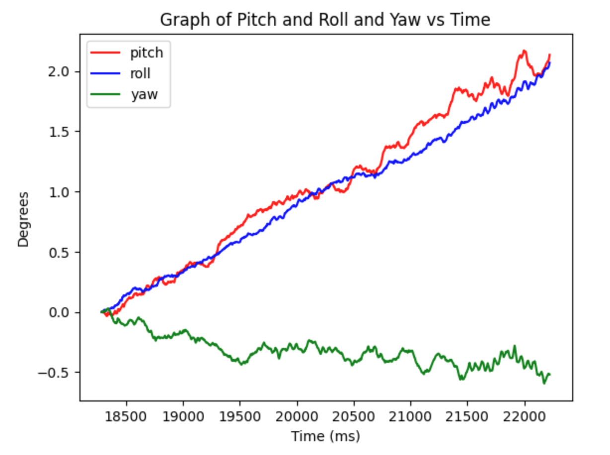
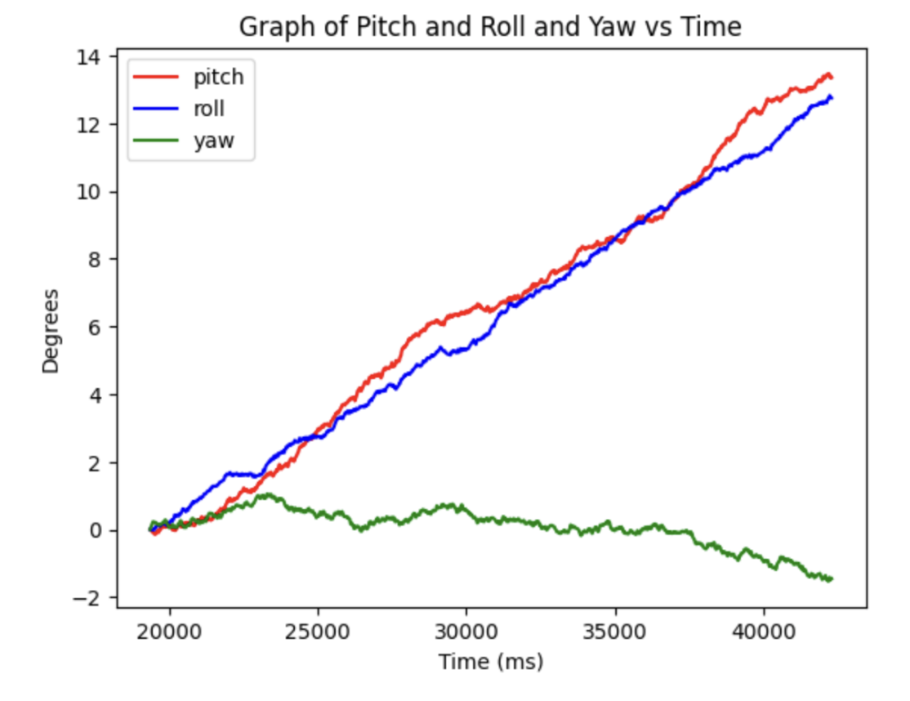
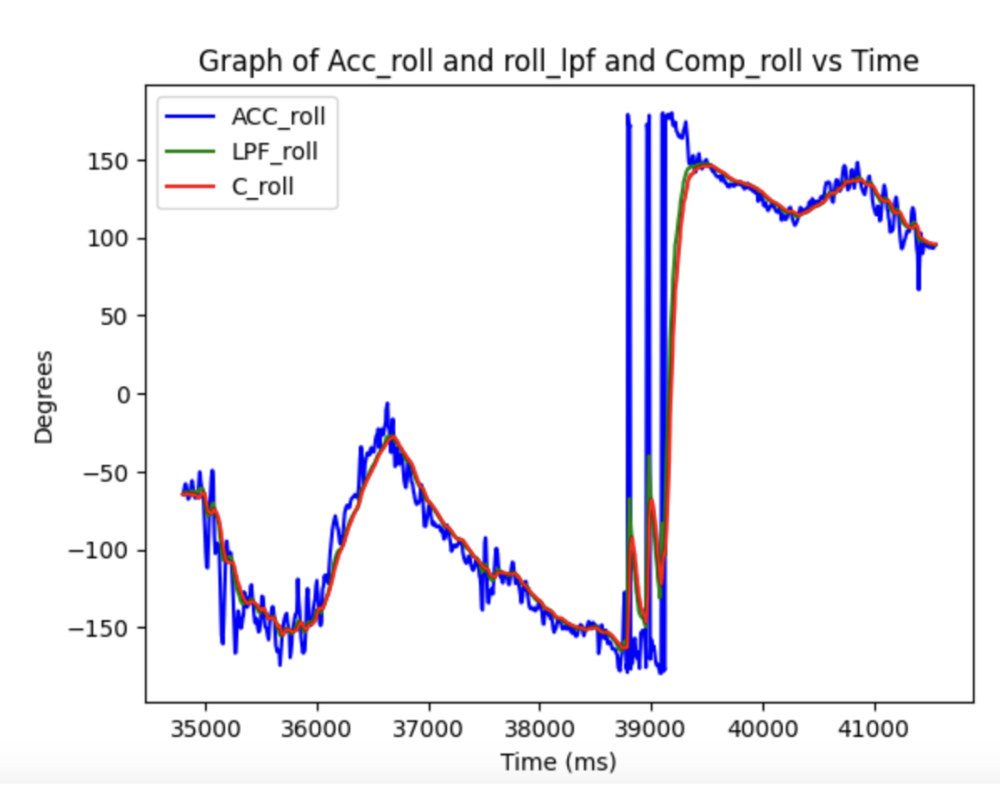
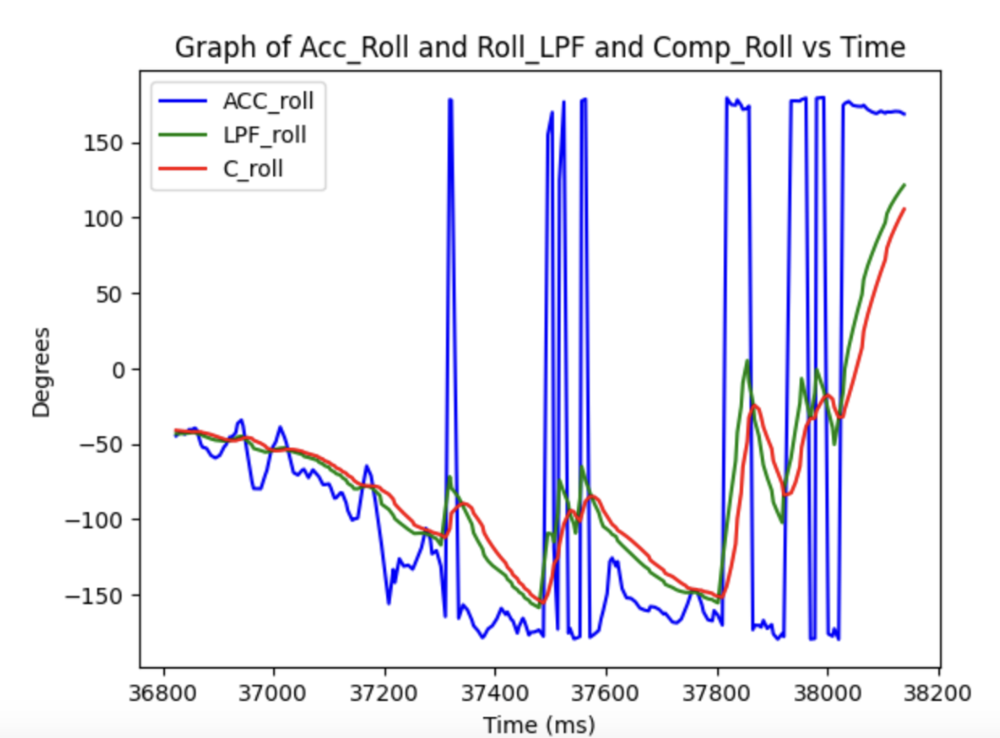
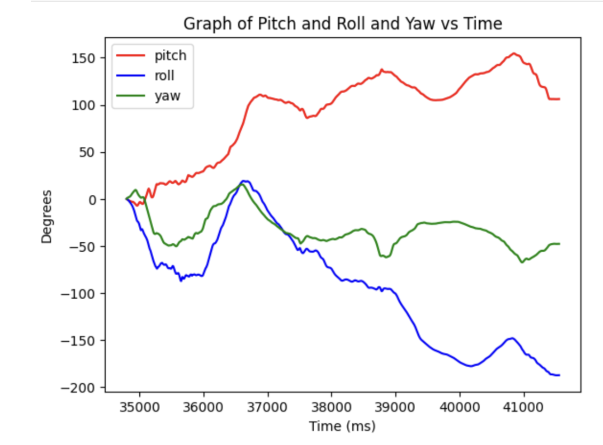
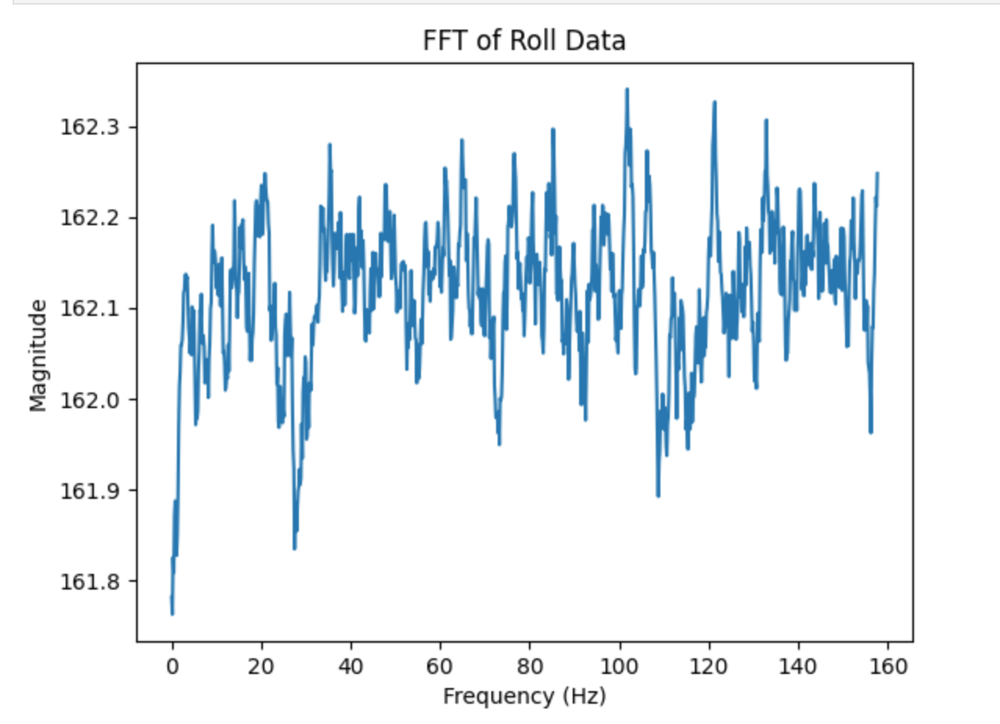
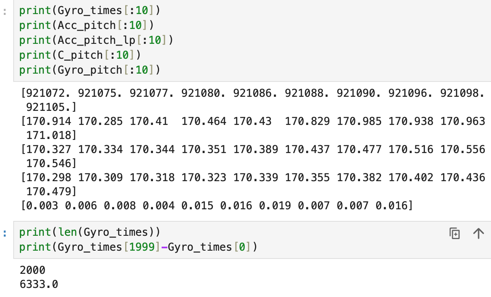

+++
title = "Lab 2"
description = "IMU"
date  = 2025-01-31
+++

> Lab2: Here we are working with the IMU so we can add it to our robot. Experimenting gathering data with the accelerometer and gyroscope, plus making a stunt with our RC robot. 


# Tasks

# Lab 2
The first lab we look into the examples given in the Ardruino library to test out our Artemis capabilities.

## **1. Setting Up the IMU**


Before we start up the lab we had to connect our IMU to the Artemis board using QWIIC connectors, and connecting it at the I2C port. 
Then we had to install the SparkFun Ardruino library in order to use the senesors provided. However, example_basics didn't work for me so instead I used the example code provided from lecture 4. the AD0_VAL I left it as 1, for when I changed it to 0 my program continously crashed. AD0_VAL is what allows us to connect 2 IMUs at the same time to the board.


To test out the gyroscope and accelerometer I used the serial plotter and ran the lecture 4 code as shown below. 


In the accelerometer data there is a lot of noise when you lay it still, let alone move it around which gives inaccurate measurements. While the Gyro doesn't have as much noise since it dependent on the change of angle. 

To make sure our IMU is working, after it is setup I implemented it such that it will blink an LED three times as shown below. 

[](https://youtu.be/FeWk2GNqrH0)


## **2. Accelerometer**

### 1. Pitch and Roll 

```c
    float Acc_pitch;
    float Acc_roll; 
    Acc_pitch = atan2(myICM.accX(),myICM.accZ())*180/M_PI; 
    Acc_roll  = atan2(myICM.accY(),myICM.accZ())*180/M_PI; 
```

To calculate pitch and roll I used these equations sourced from the lecture. Yaw can't be measured since it's on the same axis of gravity (z-axis), which is why we can only get pirch and roll from the accelerometer. The Accelerometer is fairly accurate when trying to position it and right angles such as {-90, 0, 90} as shown below. 

[](https://youtu.be/7dr8tfD84Kc)

The main issue with it is that the values flucuate a lot in small increments (noise), even when it held as still as possible or left to sit on a table. 

### 2. Accelerometer Noise and FFT 

```c
{
    case Get_Pitch_Roll: {
        int i = 0;
        for (i; i < data_array_size; i++){
            if(myICM.dataReady()){
                myICM.getAGMT();
                RoPi_array[i].time = (int) millis();
                RoPi_array[i].pitch = (float) (atan2(myICM.accX(),myICM.accZ())*180/M_PI);
                 RoPi_array[i].roll = (float) (atan2(myICM.accY(),myICM.accZ())*180/M_PI);
                delay(5);
              }
            }
          Serial.print(i);
          Serial.println(" pitches/rolls saved");
          break; 
        }
}
```

Similar to lab1, to gather accelerometer data we just created a loop that itereated through our data_array_size that in this is also 1000 samples. Using the same equations as before to calculate the roll and pitch. Here are the graphs of the all the data gathered for roll and pitch. 


 
 

This is the python used to graph it with numpy and plt packages. As well as that using the fft packages with numpy. 

 

As you can see from the FFT there seems to be a very large peak at the beginning frequencies of the array. It seems to happen at abour <2 Hz, which is what I will use at the cuttoff frequency. It being a low frequency is because the IMU already has a low pass fitler for the accelrometer and gryoscope. However, knowing what our cutoff frequency is then we can calcuate our alpha calue that we can use for a low pass filter to filter out even more noise. The cutoff frequency is important to select to block off any random or high noise, to make are data more stable. To calcualte the alpha we get RC = 1/(2 * pi * 2), then with that RC value we get alpha = dt/(dt+RC). Where dt is the average of change of time for the whole array of calcualted values for roll/pitch. We get an alpha value of .08, which we will use for our low pass filter. 


### **3. Low-Pass Filter**

```c
{
    case LPF_Roll_Pitch: {
        const float alpha = 0.08;
        Roll_lpf[0] = RoPi_array[1].roll;
        Pitch_lpf[0] = RoPi_array[1].pitch;
        for (int i = 1; i < (data_array_size); i++){
            Pitch_lpf[i] = alpha * RoPi_array[i].pitch + (1-alpha) * Pitch_lpf[i-1];
            Pitch_lpf[i-1] = Pitch_lpf[i];
            Roll_lpf[i] = alpha * RoPi_array[i].roll + (1-alpha) * Roll_lpf[i-1];
            Roll_lpf[i-1] = Roll_lpf[i];
        }
        Serial.println("lpf pitches/rolls saved");
        break; 
    }
}
```

In order to create a low pass filter we have to iterate thorugh our orignal roll and pitch data, and then adjust the values with alpha as shown above. After gathering the low-pass data, the graphs are shown below. 

 

As can be seen, the low-pass filter reduced a lot of noise! Meaning that the our data is even more accurate then it was earlier with the alpha value of .08, which will even come more into play when we do sensor fusion. 

## **3. Gyroscope**

### **1. Pitch, Roll and Yaw**

```c
{
    case GYRO_DATA: {
        int i = 1;
        float dt;
        unsigned long last_time = millis(); 
        time_array[0] = last_time;
        delay(100);
        for (i; i < data_array_size; i++){
            if(myICM.dataReady()){
                myICM.getAGMT();
                dt = ((millis() - last_time)/1000.0);
                last_time = millis();
                time_array[i]= (int) millis();
                Gyro_roll[i] = Gyro_roll[i-1] + (myICM.gyrX()*dt);
                Gyro_pitch[i] = Gyro_pitch[i-1] + (myICM.gyrY()*dt);
                Gyro_yaw[i] = Gyro_yaw[i-1] + (myICM.gyrZ()*dt);
                delay(1);
              }
        }
        Serial.println("sent the gyros");
        break;
    }
}
```

The pitch, roll, and yaw from the gyroscope unlike the accelerometer measure the change in angle/time. To calculate the gyroscope we use a whole different set of equations, where we must include the change in time (dt) which is shown above in my code. Furthermore, the angle of the gryoscrope is dependent on the previous result which showcases a lot of drift. When it laying on a table, there is no change in angle, but since it adding onto itself the roll and pitch as seen by the graphs continously increase over time. On the other hand the accelerometer doesn't have drift, but has a lot of noise which the gyroscope doesn't have. 

 

Here are two images with different sample frequencies. The one of the left is with a smaller sample frequency, while the right has a larger implemented with delays. The larger the sample rate the more drift it will have, which makes sense since dt will be larger when calculating for the roll and pitch. Meaning that you want to have the smallest possible sample rate when calculating gyroscope. 

### **1. Complementary Filter**

With the gyroscope and accelerometer we can perform sensor fusion in which we will create a complementary filter. Using the advantages of both sensors, we end up with almost no noise or drift for our calculated roll and pitch. 


```c
{
        case COMP_FILTER: {
          int i = 1;
            for (i; i < data_array_size; i++){
                if(myICM.dataReady()){
                myICM.getAGMT();
                time_array[i] = millis();
                Acc_pitch = alpha_lpf * (atan2(myICM.accX(),myICM.accZ())*180/M_PI) + (1-alpha_lpf) * Acc_pitch;
                Acc_roll = alpha_lpf * (atan2(myICM.accY(), myICM.accZ())*180/M_PI) + (1-alpha_lpf) * Acc_roll;
                dt = (time_array[i] - time_array[i-1])/1000.0;

                Comp_pitch[i] = (Comp_pitch[i-1] + myICM.gyrY()*dt)*(1-alpha_comp) + (Acc_pitch)* alpha_comp;
                Comp_roll[i] = (Comp_roll[i-1] + myICM.gyrX()*dt)*(1-alpha_comp) + (Acc_roll)* alpha_comp;
              }
          }
            break;
        }
}
```

Here is most of the code used for create the filter, and key to note is that we also use an alpha value, but this alpha is different from our low pass filter one. In this case we need to adjust our alpha to when we start seeing the low-pass filter peak, which is at around 10 Hz as calculated using the FFT graph. Seeing that around that hertz is where it stabilizes, I was able to calculate with the same formula as before the alpha to be .3 which is what I used and it worked really well as shown below.

  
 

These graphs are displaying data of me while I was moving and rotating the imu around which is why the normall roll and pitch go hectic. However, as you can see with the zoom in graph (top right), the complementary filter did its job. It was the smoothest graph out of all three options, even though the low pass filter was very similar. However, we can also see that there is a lot of noise if you don't use a lpf. It makes sense though why the complementary filter didn't get too affected cause we push a low-pass filter on a low-pass filter, that is passed on a built in one on a chip. There only room for so much optimization. 

## **2. Sample Data**

Now its time for optimzation within our code in order to get the fastest sample rate and message sent across. To do this I removed a lot of useless code and print statements that took up time. Furthermore, I removed a lot of the delays and made it such that all the values of accelerometer roll and pitch, gyroscope roll, pitch and yaw, and complementary roll and pitch can be calculated in one command. Meaning that I don't have to call multiple commands since all the calcualtions including the low pass filter of the accelertometer are performed. I also ran some tests to see what would be faster, sending the data live while computing or just computing the array then sending that. To my suprise there was a significant difference between live sending, and sending the data after its collected! If you send it live to gather 1000 samples it took 30 second meaning our sample frequency was very large! This resulted in a cascading affect where of gryoscope was less accurate, which also meant the complementary too. On the otherhand when I first got the 1000 samples then sent it, it was blazing quick at only around 3 seconds to gather all the data! 10x faster then before which also meant our dt was smaller giving us vetter gyroscope data. It still however, took a long time to send but I would rather have that occur then when it's collecting data. 

Knowing this information in order to gather 6 secons I simply just collected 2000 samples as shown below. 2000 samples collected is around 6.3 seconds, but it still took a minute to send it all. I also printed some of the pitch values of all the sensors to showcase it gathering the data. 




[](https://youtu.be/3K57tmdrMm0)

With this speed of 6.3 seconds to collect 2000 samples, that about 300 samples per second. With the memory size of the Artemis being 384KB, lets just assume you're gathering every data you can from the sensors (10 floats * 4 bytes) meaning that you can collect 9600 sets of data points. Which then at 300 samples per second will end up with it being filled with data in 32 seconds!


## **Car Stunt**

Now here me playing around with our RC Car!

[](https://youtu.be/vM4l_CRC5J4)


