+++
title = "Lab3"
description = "Third Lab"
date  = 2025-01-31
+++

> Lab3: In This lab we add TOF sensors to transmit distances for our car robot while its traveling. 

## **Prelab

For the prelab, we have to give thought of the place of out ToF sensors. There are several combinations possible, however, I will choose front and back to place my ToF sensors so that it can traverse both forward and reverse knowing if there are any obstacles in the way. However, it will have blind spots at its sides which may cause trouble avodiing obstacles. To use both sensors first, we have to take note of the address of them. Both of them share the address 0x52. This needs to be changed when we run them they don't conflict. To do so one of the sensors we will soder on an extra cable connecting XSHUT to an analog pin on the Artemis. In this case I used A2, and we set the pin LOW in our code then alter the address (I did 0x32), aftewards to use the 2nd one you set the XSHUT high. Allowing both sensors to run at the same time.
```c
    digitalWrite(SHUTDOWN_PIN, LOW);
    distanceSensor1.setI2CAddress(ADDRESS); 
    digitalWrite(SHUTDOWN_PIN, HIGH); 
```
Wiring Diagram: 
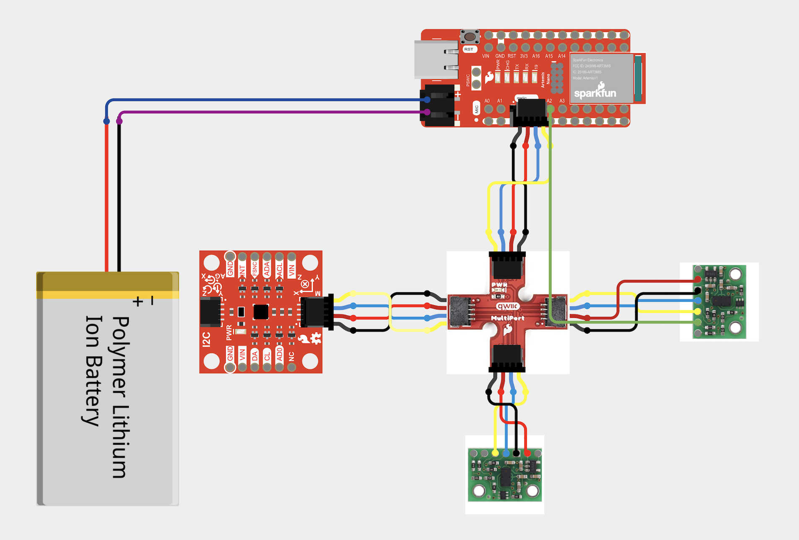

# Tasks

# Lab 3

## **1. ToF and Breakout Board **

Using the wiring diagram above, we were able to connect the ToF to our breakout board as seen:

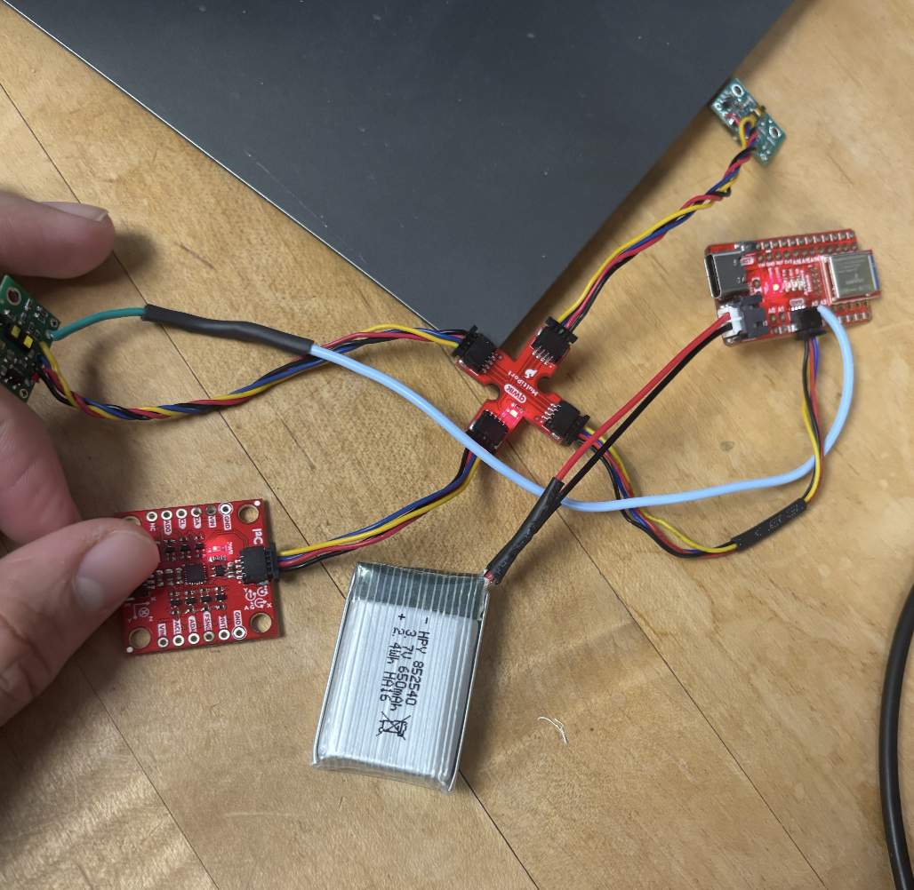

Noting that like previous lab, we are able to power it up with the battery and connect to it via bluetooth. 
Here how the board was soldered: 

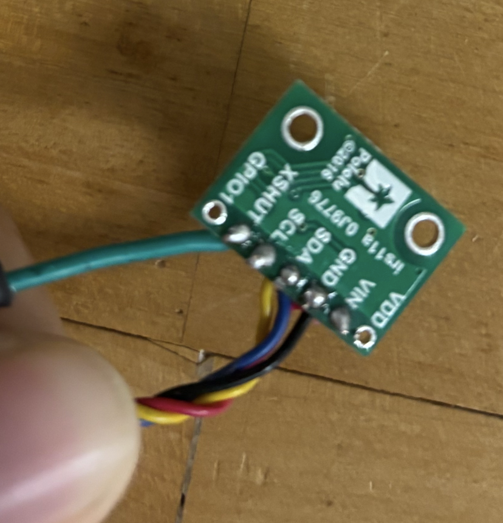 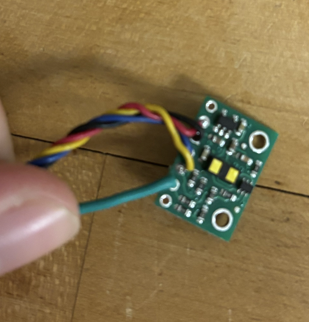

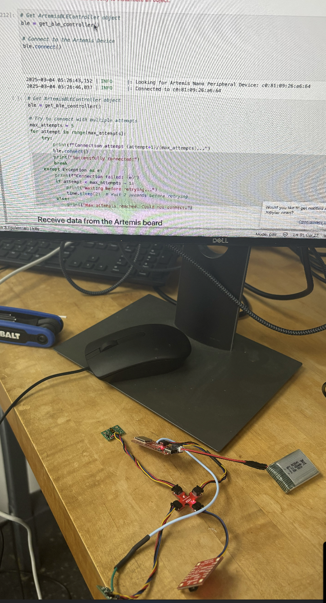


## **2. Scanning the for Address

    > file->Examples->Apollo3->Example05_Wire_I2C.ino


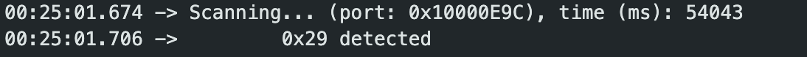

    We get an address reading of 0x29. At first I was perplexed since it didn't match 0x52 from the datasheet. However, I realized with the last byte of both 52 = 0101 0010, 29 = 0010 1001 that 0x29 is just 0x52 but shifted to the left. The LSB got removed since this is the read/write bit, meaning we can assign with any address != 29. 


## **3. TOF Sensor 

    The sensor has 3 modes, short, medium, and long. The larger distance mode you choose, the more it is affected by ambient light. Long has the longets distance of 4 m, however, will only be able to measure 73 cm with strong ambient light. Short doesn't get affected by ambient light as much, and can do around 136 cm both in the dark and with strong ambient light. Which in our case will prove to be very useufl since we will most liekly driving our guy with ambient light around, rather then the dark. We want the farthest distance we can get with that affecdt, which in this case is short. 

    I've decided to test short range:

 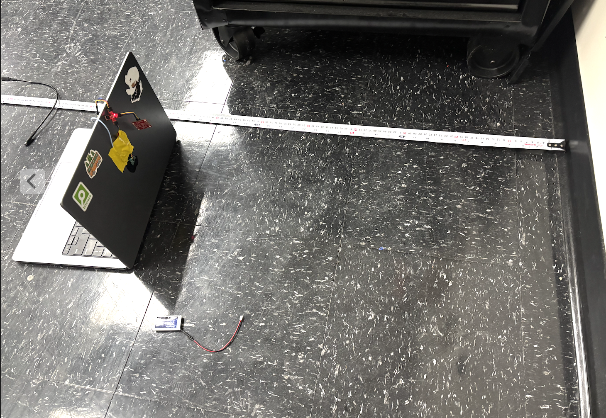

    Here are the measuremnets of actual vs measured between 400 - 1900 mm: 

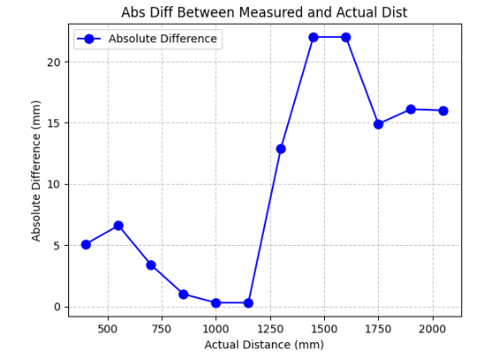 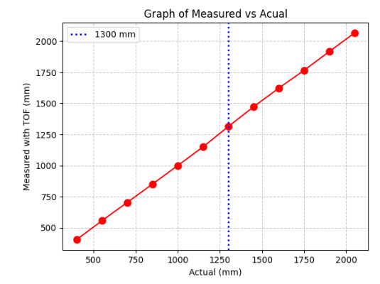


    Looking at these graphs once you reach past 1300 mms the data becomes less accurate which is to be expected. Graphing the means using np.mean and mp.std to get standard. The std increased the further we got, showing more noise/variance in measurements. 


## **4. Multiple ToF and IMU 

    Setup for 2 ToF by changing address of one of them: 

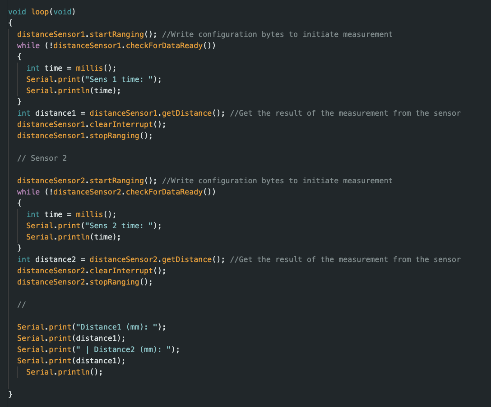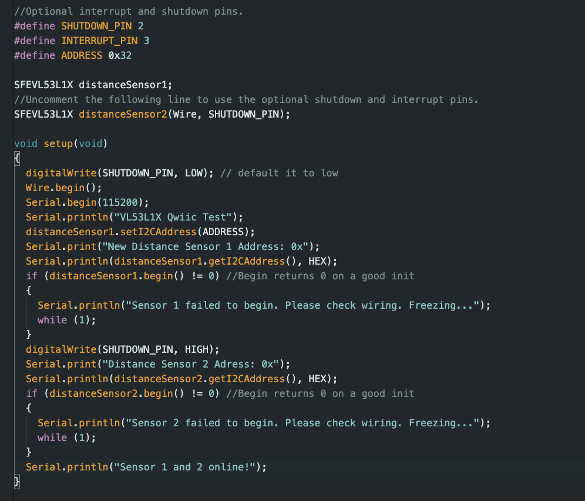

    Connecting 2 ToF and IMU we collect 2000 sample data points and then send it via bluetooth. These are the results: (Collected parallel as can be seen by X-axis)

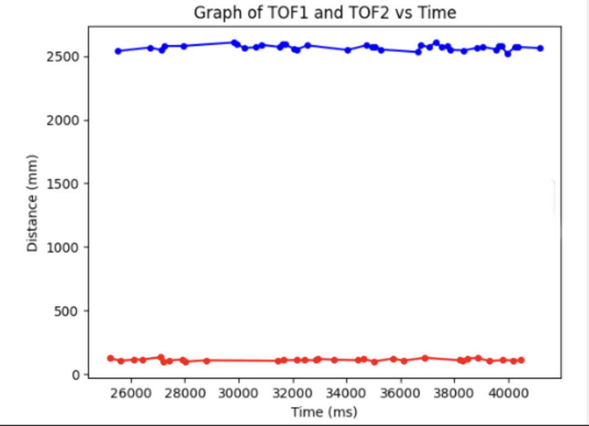 
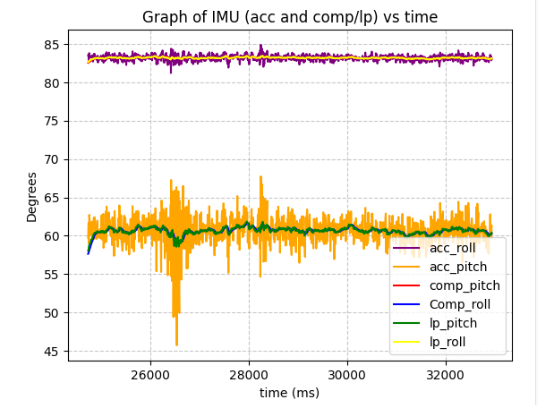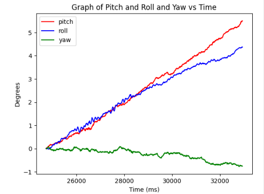

[](https://youtu.be/kcKIogiezIA)

Key note is that ToF sensors collect less data points over the same period as the acc and gyro. As can be seen on teh graph ToFs collected ~31 points while acc/gyro collected 2000 io the same time. I had to create a seperate array such that when I graph it the distances won't be zerod out since it there were no distances collected for hundreds of time stamps. 


## **5. Limiting Factor 
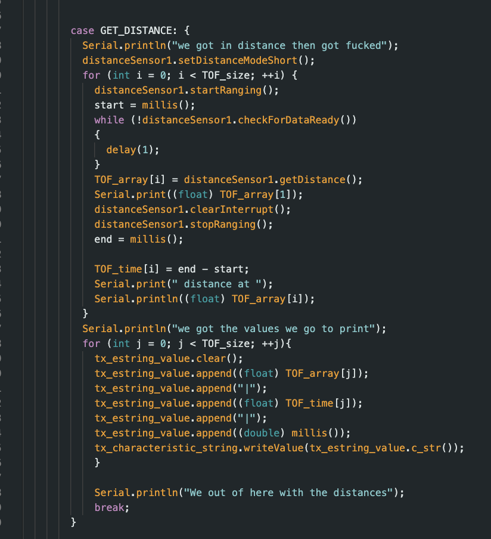
[](https://youtu.be/X2TuPMtNqvs)

As previousuly mentioned ToF sesnors need time until it can collect data again.  The time it took for a since ToF varied around 6 ms, and the 2nd was longer with 9ms. Which seems extremely small however, relative 2 the other sensors which collect data incredidbly fast it is slow. Which is why when collecing data, i accounted for a seperate time/collection array just so the values didn't bounce to 0. The limiting factor would in this case be 9 ms the longer time to collect data. 


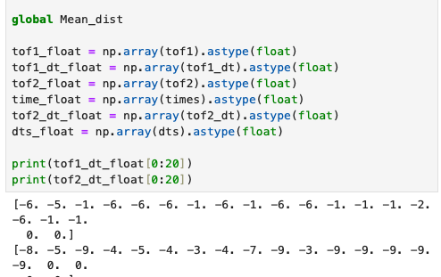


