+++
title = "Lab 10"
description = "Bayes Filter"
date  = 2025-04-22 
+++

> Lab8 : Bayes Filterization 

# Tasks

# Lab 10

## **A. Compute Control**

The first function we had to create was compute control. This function takes in 2 inputs of the previous and current odomoetry positions of the robot state. Since in this simulation the roboto state is given as (x, y, theta) it made it easy to to return the control information. Following the formulas provied in lecture, it was easy to calculte the inital rotioatn, translation, and final rotation. Keeping in mind that odometry is used after the robot itself moved making it useful for us in this lab for localizaiton, and recontructing the motion between 2 robot states. 

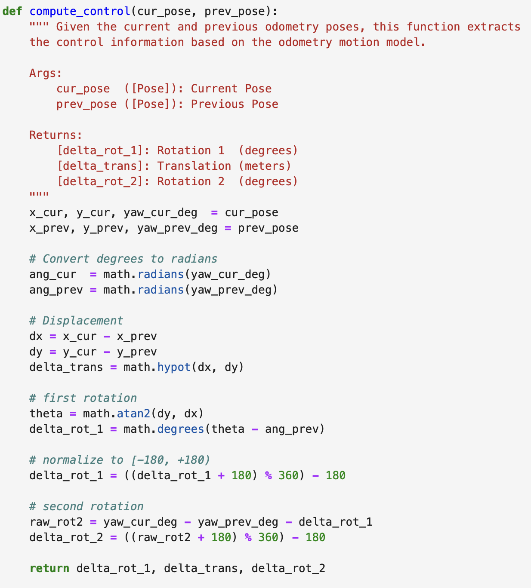 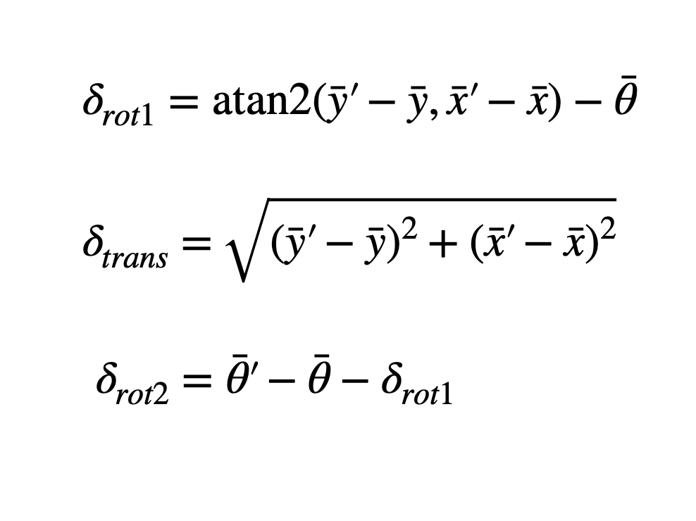

## **B. Odom Motion Model **

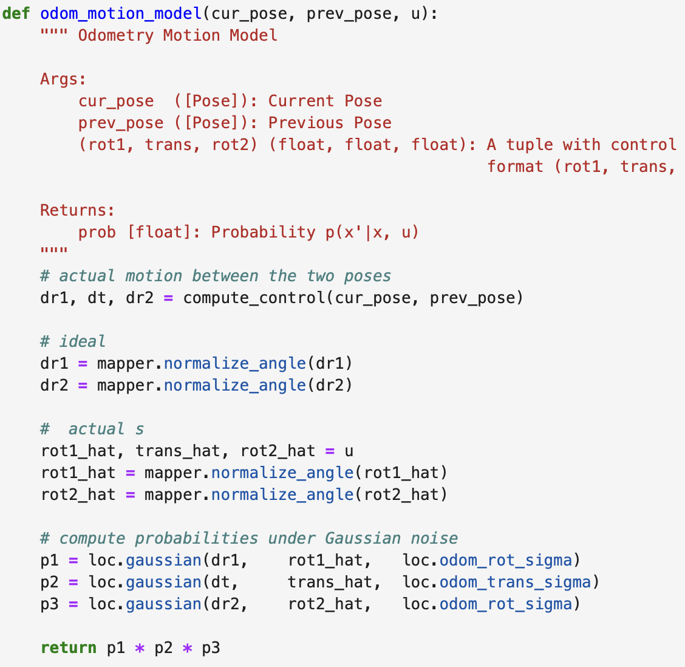 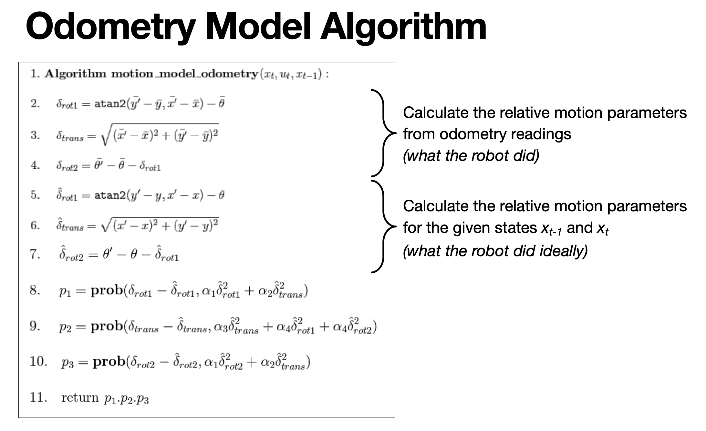

The next function we created was to see the probabilty of our current position given our prev position and the control read up by the odometer. We calculate what we ideally should've done for control using our previous function and the inputs of prev_pose and cur_pose. Then we compare this to what the odometer read since the odometer does have some noise. Getting the probailty of the ideal motion done vs what was given by multiplying each parameter's probility using gaussian. Giving us our transition probabilituy used for our predition step for our prior belief calculation. The probabilty that our robot is in state x given the previous state and control u. p(x | x' u)

## **C. Prediction Step**

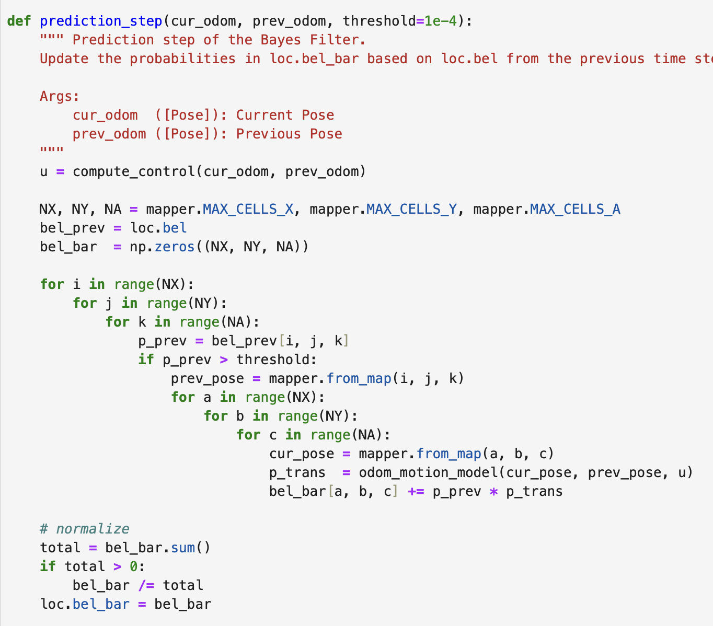 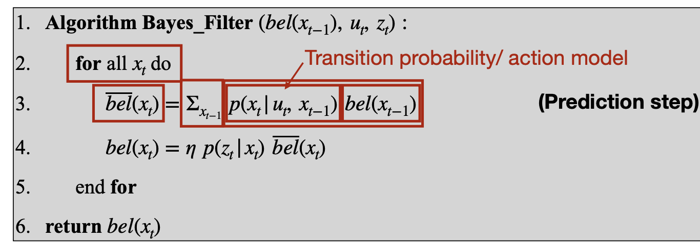

Next, we computed the previous belief by calucalting the  prediction step. Since we already set up a function to get the probailty of transition, all we had to do is multiply this probility with the belief of the previous state. However since we have around 2000 states to iterate to calculate a belief, we included a threshold as the lab suggested to ignore and probilites less then .0001 since they didn't contribute much to our beliefs. However we did have to normalize it at the end to make sure it still all added up to 1. 

## **D. Sensor Model**

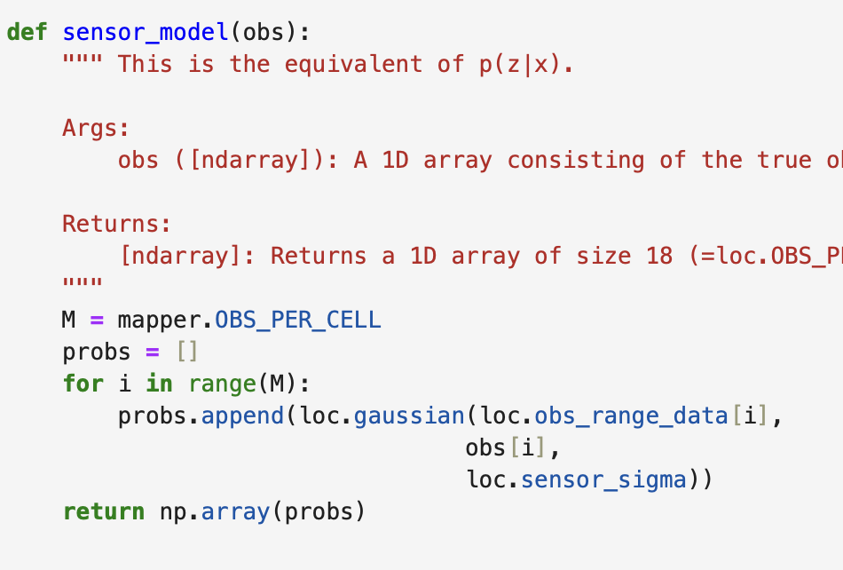 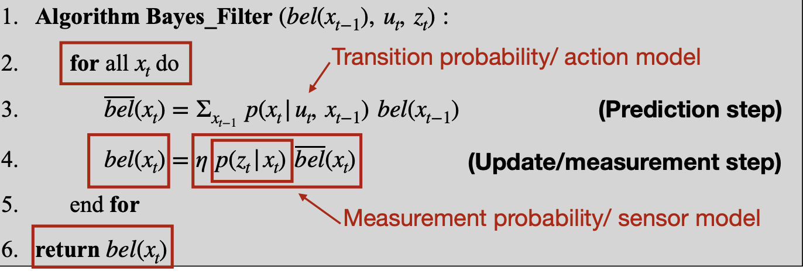
Next in order to calculate the update step we need to find the measurement probabilty p(z |x). This essentially is how measurments are generated based on the robots state. To do this simply we found the probabilty using a gaussian distrubtion with the true observations, collected observations, and standard deviation of sensor noise. 

## **E. Update Step**
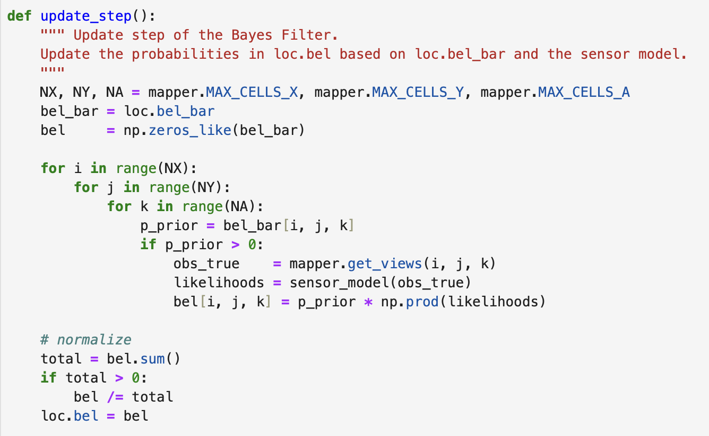 

Finally with sensor model we just needed to calculate the update step portion to get the belief. To do this we multiplied our measuremnt probability with our prior belief similary as our last functino we have do to it about 2000 times. However, no summation is needed allowing us to use simpler code. Getting our observed sensor reading and then getting the proabilitiy with our snsor model function, we multiplity it with our prior belief to get us our beliefs. As showcased in the formula below. 

### Bayes Filter

After finishing the update step now we have all the components in order to use bayes filter which fundamental algorithm for estimating a robot’s state (location) under uncertainty by continually predicting where it might have gone and then correcting with whatever measurements it actually observes. The odometer as can be seen in the video and images below is very noisy/innacurate (red) however, despite that bayes filter is able to overcome it and give a pretty decent estimation on the robot's state (blue) which closely followed the true path green. 

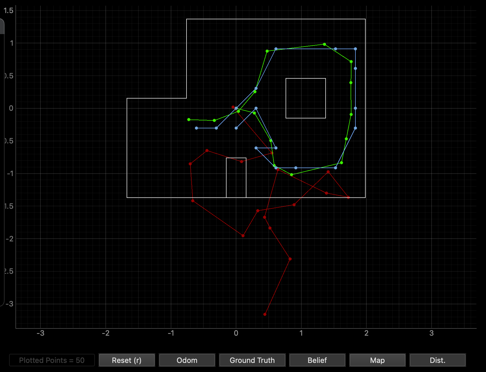 
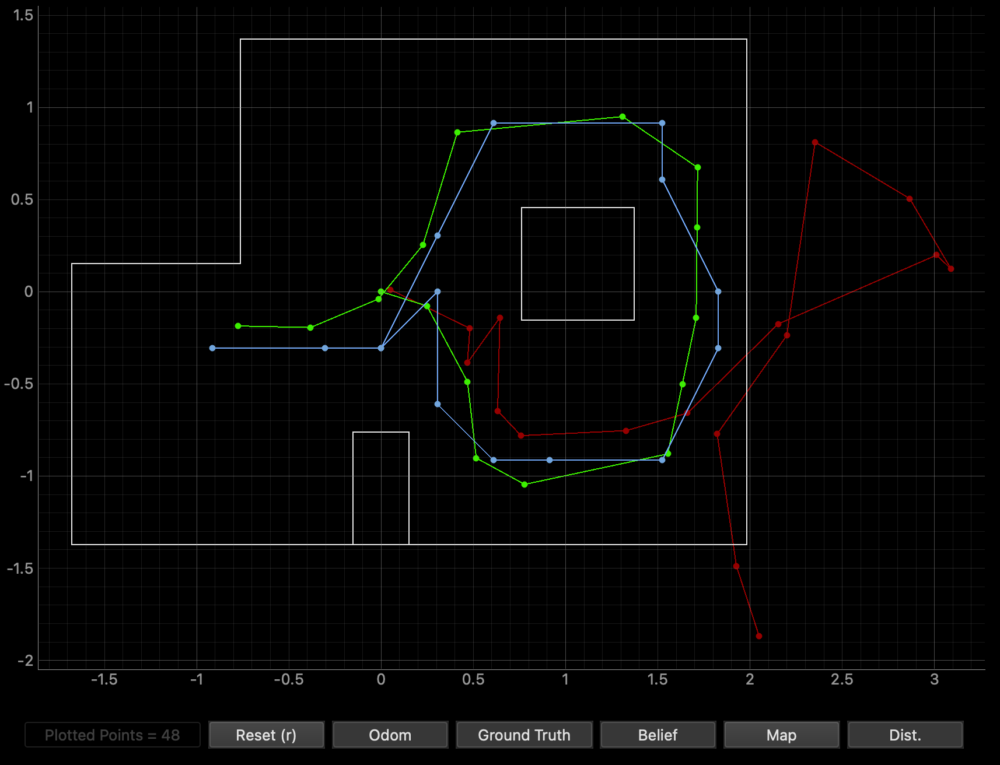 

some key factors that helped out is that we knew the intial state of our robot for this simulation, we could calculate our inital belief which is required for the algorithim to work intially. 