+++
title = "Lab 11"
description = "Localization"
date  = 2025-05-15 
+++

> Lab 11 :  Localization on the real robot

# Lab 11 Localization 

## A. Simulation

Similary to lab 10, we had to make sure the simulation for this lab worked propely by running lab11_sim.ipynb. Copying over the functions used in lab 10, we got these results for our simulation. 

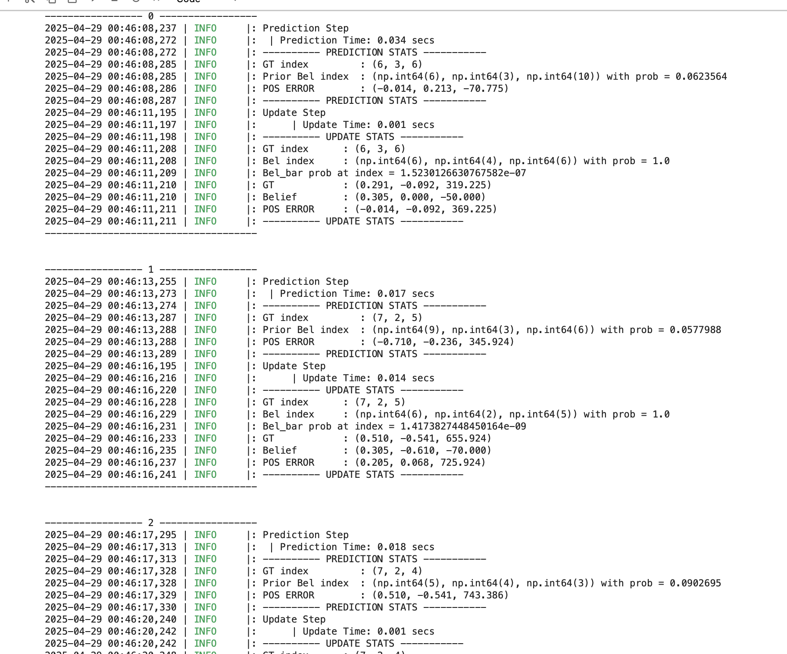
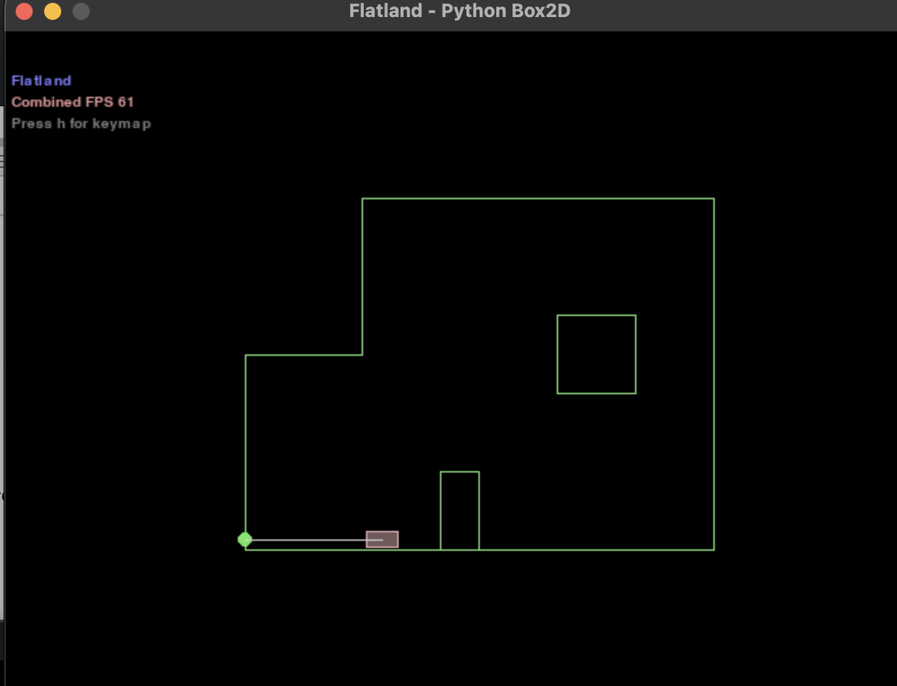
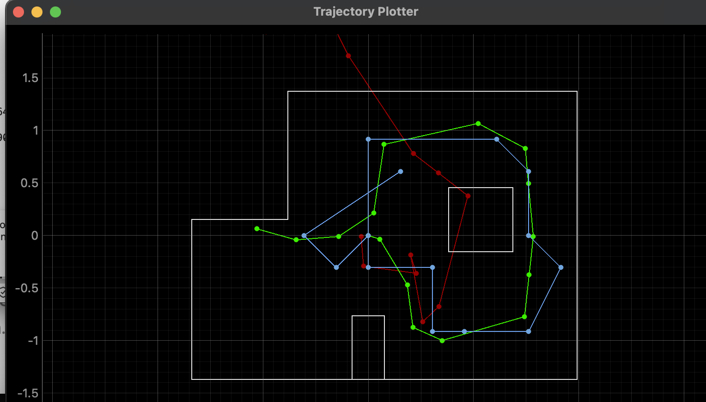

As we conlcuded last last with red being the odometer, blue being the belief and green being the truth, the odomoter is incredidbly horrible at giving accurate data to the robots position in the map. However, the belief with the bayes filter is fairly accurate to the actual location of the robot. 

## Real World 

Using Bayes Filter there is a predicaiton step and and update step. However, with our currents sesnors we don't actually have an odomoter to use, meaning that we really can't use the prediction step. Instead that means that we are only using the update step of the Bayes Filter. You could use the IMU with its accelerometer/gyro scope to supplement the odomoter however as seen by previous labs there is a lot of noise using it and it not worth the stress getting it to work. In order for the robot to guess its location we instead make is spin in place for a full circle taking measurements at incrmenets of 20 degrees. With the infomration that it gathered from this we then calculate the update step, which is done by using the perform_observation_loop function that we have to implement in the lab11 python file. Here is the function implemented. 

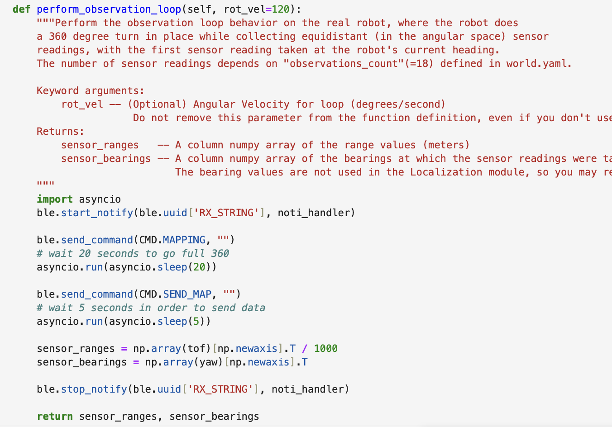

Also with the notification handler that we used in previous labs modified for this lab

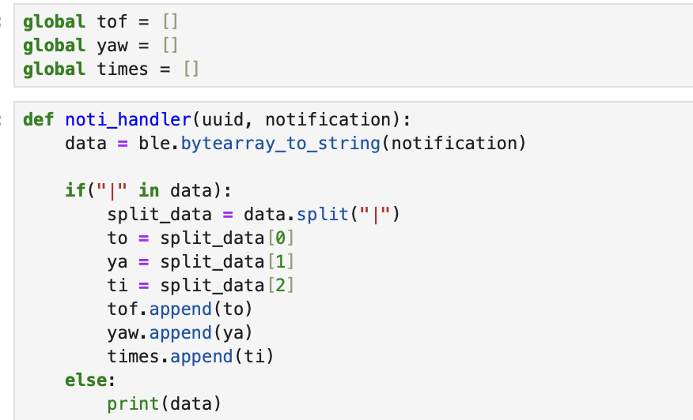

after connecting the robot with bluetooth, perform_observation_loop starts the notificaiton handler and sends the command to the robot to capture the the (360/20) 18 degree measurements for its given position. In order to make sure it has enough time to gather all the data we use asyncio to provide a delay of 10 seconds. At first I used time.sleep(10), but this caused the thread to be blocked, which is not ideal since we want the program to run concurrently. Afterwards we send the command to retrieve the data, and also provide a small delay to ensure all of it gets transfered  Next, we divide our measurements by 1000 to get it into meters and then converting the ray into a column vector by using np.array(array)[np.newaxis].T as per the hint. Returning our ranges and bearings as expected.

The commands that it ran use the code utilized in lab 9. Instead of going clockwise this time we are going counter clockwise and turning at 20 degrees instead. 

## Results

Now testing it we are given 4 points in which we have to localize at. 
(-3 ft ,-2 ft ,0 deg)
(0 ft,3 ft, 0 deg)
(5 ft,-3 ft, 0 deg)
(5 ft,3 ft, 0 deg)

the graph provided is in meters scaling not feet. However looking at our gathered data we can see that we got fairly accurate results in the robot localzation. 

### (-3, -2) 

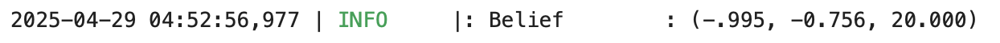
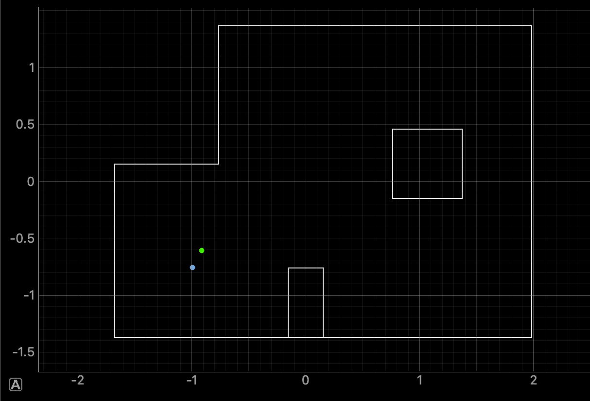

The robot here consistently showcased it belief being very accurate to the ground truth throughout various runs. In this run the robot was slighlty off in the x and y axis being oriented a bit lower and to the left then the truth. This most likely stemmed from the fact that the robot had to measure data from the open gap at the top right which most likely either maxed out on the sensor or inaccuraetly meaured above the wooden wall. 

### (0, 3) 

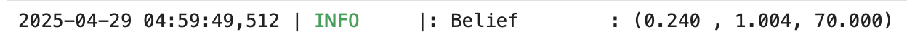
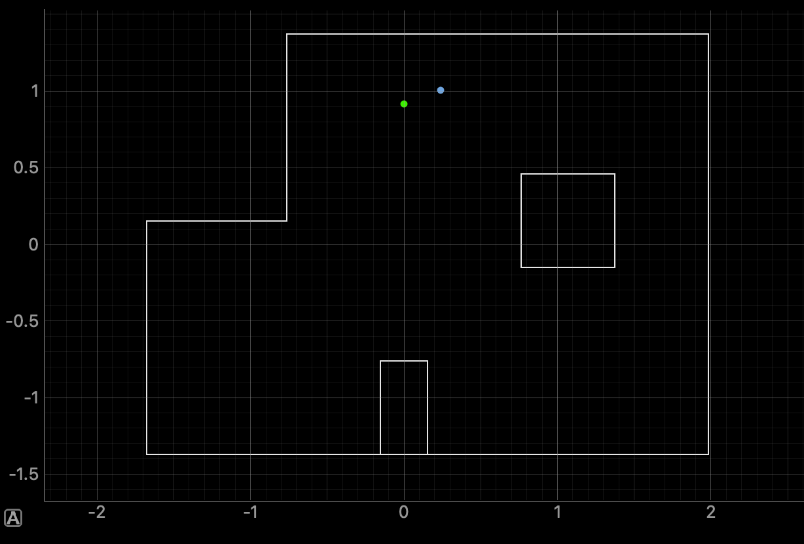

This point was also showcasing a very accurate belief to the truth. This is some right shift, however, the data gathered here at this point is very unique alloiwng for a high belief in the baye's filter. With the top left being corned and the bottom and right having gaps, the robot was pretty much spot on every run when testing. 

### (5, -3) 

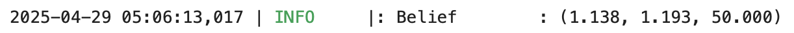
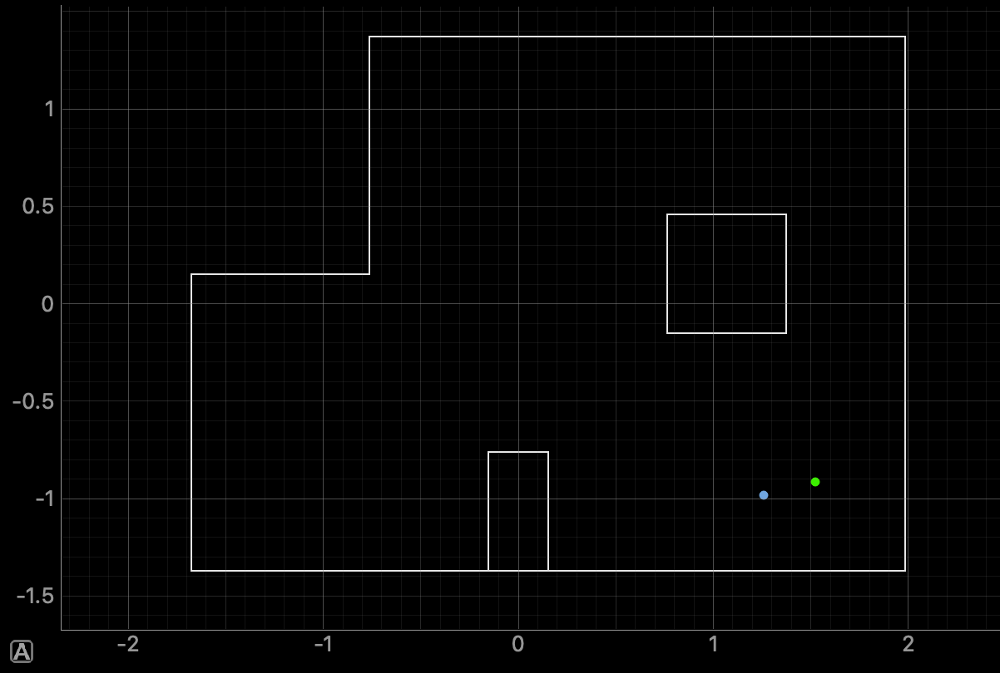

This spot performed the worst when it came to running test runs for the spot. It kept believing that it was locating at (-3, -2) throughout my trials. However, at times it was able to accuraelty get a decent belief as showcased here. My best assumption is that the robot is getting wrong data when scanning around the top left corner. The sensor could be maxing out or as mentioned previosuly if the ToF slighltly tiled upwards/downards would give results of false wall enclosure. I do wonder if possible if we incrmented in more smaller increments, it would provide a better accurate belief. 20 degrees may seem small enough since it gets 18 different orientations, however, the small box enclosure at the right won't be accuratly scanned due to its distance. If it was closer to the robot it being read would'nt be a problem, but I fear that sometimes the robot doesn't really factor the data gather when it does scan that box since it may only be 1/2 orientations that accurately portray it. 

### (5, 3) 

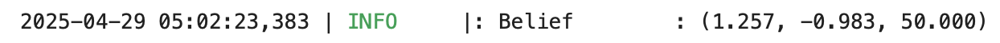
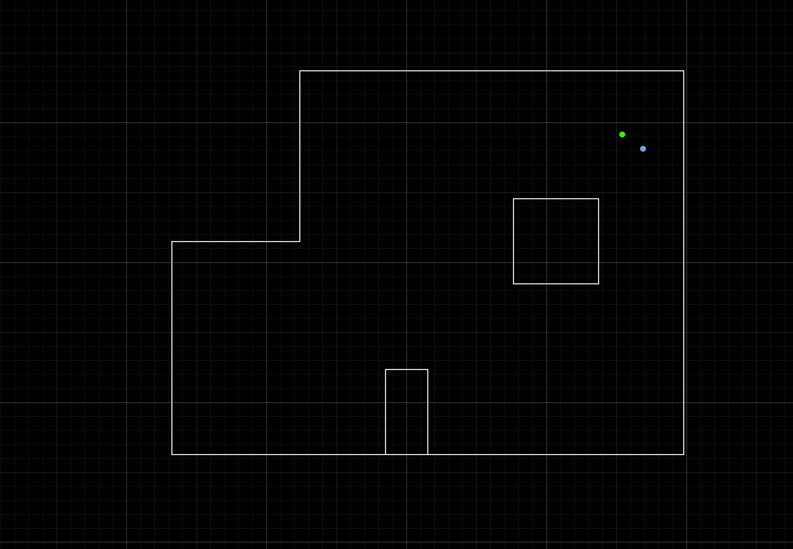

Similary to the previous point (0,3) the belief is very accurate to the truth. For similar reasoning that the data it gathered was unique to its position being that is next to the top right corner, with openings towards the bottom and left. 

## Conclusion 

All in all, the robot in was able to localize itself at all the points. The bottom right point (5, -3) being the worst, however, my reasoning behind that is described above. I do belive that if the walls/items are closer to the robot it belief is far more accurate to the truth since it can get more readings from its orientations as seen by the top right and bottom left. I do wonder if changing the degrees to 10 to double the amount would alter these reults, and seeing if changing the positiong of the Tof could've affected it. Furthermore maybe possible incoprating 2 ToFs, such that I get double the data at the same orientation might have either helped or showed the same results that is unknown. However, due to my 2nd ToF not being a perfect 90 from the first it actually might've aided in providing a proper belief since It could gather for example the small enclosure when the first ToF didin't many readyins. Baye's filter, in general is a fairly accurate method of determing a robot's location even without our preidcition step being used.

