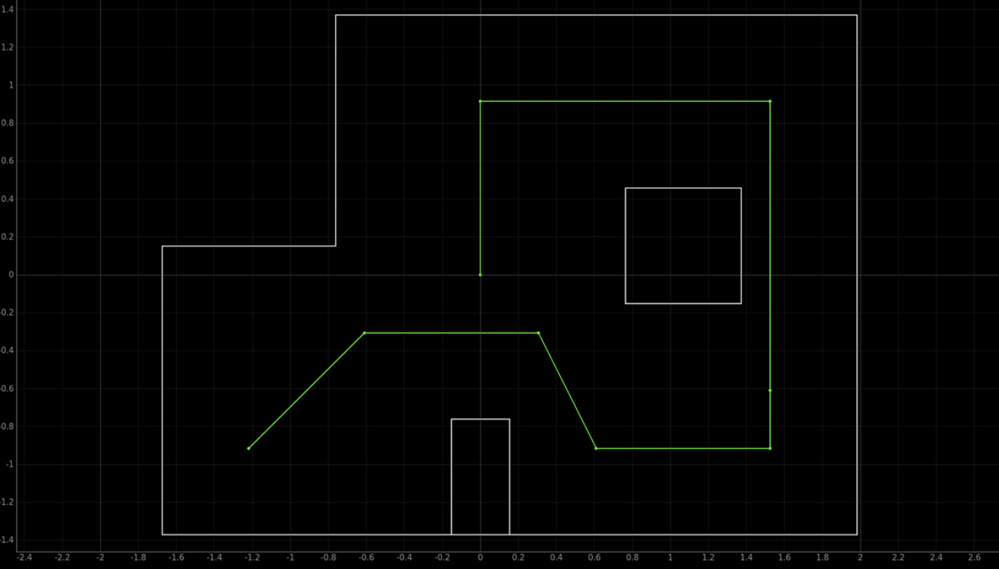
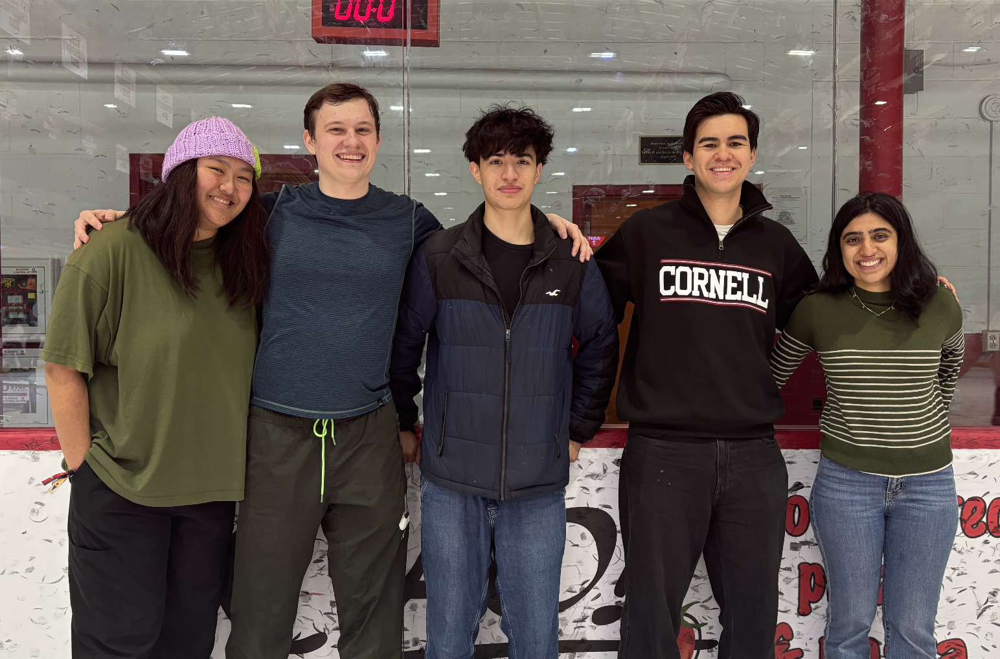

+++
title = "Lab 12"
description = "Path Planning"
date  = 2025-05-14 
+++

> Lab 12 : Path Planning and Execution



The final lab in which we have to naviagite throghout the waypoints in as fast and accurate manner as possible. Here the image of the bath that we had to follow through. Starting from the bottom left and naviagting in a loop and ending at the center of the map.  

This lab I worked with Jorge Corpa and used his car for the video since my car orientation didn't work as smoothly as Jorge's. Jorge's orientation was much better then mine, and was mucuh easier to work with and debug. Sadlt I couldn't get Lil Homie working with the orientation and gave up. 


# Lab 12

## **A. Theory crafting **

Throughout this lab I worked with several of my friends and brainstormed numerous methods of accomplishing this lab. Since I had back to back finals on this my friends had an early head start in which there feedback impacted a lot in the method I chose to do this lab. 

Localiation was obsiousvly the goal to get this lab done with, since that would prove to me the most consistent method. However, even though this method was ideal it did not pan out that way when trying to run it. The ToF sensor kept providing inaccurate measurements of data that caused the robot to believe it was a different location then it was. My biggest belief in this was the ToF sensor being off angled by a few degrees. Even though it is only a few degrees off angle that would cascade in false data being read since it would try to read further distances and max out the ToF. Which when it did max out, for example at the bottom right corner it resulted in false informaiton being provided, and confusing my lil homie robot. After an hour I called it quits and decided to implement the open loop approach which could be implemented in several ways. 

Open Loop: Now there are 2 main ways I thought about doing this. These 2 different ways was simply the method I choose to go forward wether it was time based or wether it would be from my reading of the ToF. The premise of the open loop method is really simple go forward turn go forward turn go forward and repeat until it did the whole path. While the turning was just reliant on our PID implemenation from lab 6. Here some of the code that was used.


```c
{
case navigate: {
  forward(x);
  PID_Control(angle1);
  forward(y);
  PID_Control(angle2);
  forward(z);
  PID_Control(angle3);
  forward(q);
  PID_Control(angle4);
  forward(t); 
  PID_Control(angle5);
  forward(r); 
  PID_Control(angle6);
  forward(w); 
  }
}
```

## **B. Open Loop **

Using the ToF and PID in order to stop the car a certain distance would be the prefered method. This would prove to be the most consistent method since obviously you would stop at the exact distance that you want. However, in order for this to work the ToF had to be very reliable. Which whle testing at first sadly didn't prove to be the case. Furthermore this method required us to get the distances from the walls to the point. However, throughout the numerous runs it would prove to be inconsistent. One was because since tthere was continous people testing there robots on the site, the walls would alter in placements and I didn't help with my robot swerving around and crashing the walls. Resulting in it being off a few cm each iteration, wether it be the sensor reading being to slow for the robot or the envirionment changing. Calculating the distances in a fixed environment wouldn't be to awful especially since the distances from the wall to the robot will always be constant. However, there is a flaw in the fact that the sensor readings might be to slow for more small spaces In a environment changing simulation this would prove not that useful for consistent path sadly as I learned. 

Next something that really doesn't alter the environment and our final method of doing it was just controlling the forward motion of the robot with time. This in theory will always result in consistent forawrd motion, however, in reality this did not always prove to be the case. At times 500 ms was the perfect amount, then it would overshoot then undershoot and rinse and repeat. It became more of a luck based system wether the run was gonna accomplish it or not. To implement this timing it was quite simple we just used some of the logic we used for lab 8 in flipping where we went forward for a set amount of time. Chaning a bit since this time we don't have to collect PWM or ToF sensor data. 

```c
{
void forward( float t ){
  // initial time 
  float init = millis(); 

  // we used 120 PWM for a slower velocity
  // both pins are to go forward 
  analogWrite(1, 120);
  analogWrite(16, 120);

  // while loop to meet timing requirement 
  while (( millis() - init ) < t ) {};

  // STOP THE CAR
  analogWrite(1, 0);
  analogWrite(16, 0);  
  }
}
```

Furthermore her is some of the PID orientation code that was used (same code as lab 6)

```c
{
float error = yawAngle - targetYaw;
integral += error * dt;
integral = constrain(integral, -1000, 1000);  // Anti-windup
float derivative = (error - previousError) / dt;

float pTerm = Kp * error;     // Proportional Term
float iTerm = Ki * integral;  // Integral Term
float dTerm = Kd * derivative; // Derivative Term

float output = pTerm + iTerm + dTerm;
int motorSpeed = constrain(output, -255, 255);

// Ensure Minimum Speed
if (motorSpeed > 0 && motorSpeed < 120) {
    motorSpeed = 120;
}
else if (motorSpeed < 0 && motorSpeed > -120) {
    motorSpeed = -120;
}
}
```

```c
{
case PATHING: {
  sucess = robot_cmd.get_next_value(x);
  sucess = robot_cmd.get_next_value(angle1);
  sucess = robot_cmd.get_next_value(y);
  sucess = robot_cmd.get_next_value(angle2);
  sucess = robot_cmd.get_next_value(z);
  sucess = robot_cmd.get_next_value(angle3);
  sucess = robot_cmd.get_next_value(q);
  sucess = robot_cmd.get_next_value(angle4);
  sucess = robot_cmd.get_next_value(t);
  sucess = robot_cmd.get_next_value(angle5);
  sucess = robot_cmd.get_next_value(r);
  sucess = robot_cmd.get_next_value(angle6);
  sucess = robot_cmd.get_next_value(w);
  }
}
```


In order for us to save so much time, instead of hardcoding different values of T and angles we simply create a command in python to ouput the values tbat we wanted as time and angles. Allowing us to keep values that work and also fine tune and tweak the values that we already had. 

```python

ble.send_command(CMD.PATHING, "700 | -30 | 500 | 80 | 300 | -50 | 200 | 30 | 900 | 40" ) 

```

You would think this would be streamline to do however, it is not. It took several tries to get it to work once and it took a while for it to run. The video here is 2 minutes long, and I've seen groups doing it much faster. However, Our open loop control was very accurate at the sacrafice for that time. While it is possible to have an accurate and fast localization that is now what I did. Here is the video of the car going through the track: 

[](https://youtu.be/i1Tq-JVp6ws)

In terms of consistency, it will be able to go around the track again however, it won't always be as accurate as the run posted. As mentioned before it is a luck based systems at times it felt wether or not it was going to reach the marks. However, when it did it was very accurate it made our days. There no audio sadly in the video due to the fact a lot of crashing out was occuring throguhout this lab.

## **C. Farewell and Resources**




Huge shoutout the TAs and Professor Helbling these labs were rigourous however taught us a lot about robot localization. Furthermore shoutout to Aidan Derocher, Jorge Corpa Chung, Jennie Redrovan, Sana Chawla, and Lulu Htutt for being great friends I met from this class and helped throughout this lab and many others. It is sad that I met them this semseter and some of them are graduating, but we shared a lot of suffering and laughter from this class and good memories because of it. Lil Homie, my robot surprisngly never had any issues in terms of wires popping off no matter how much walls he has been thrown at. 