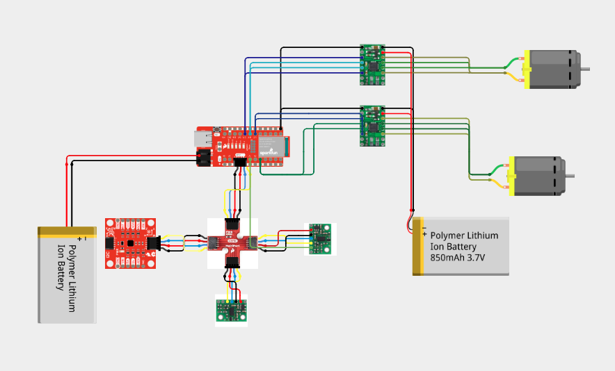
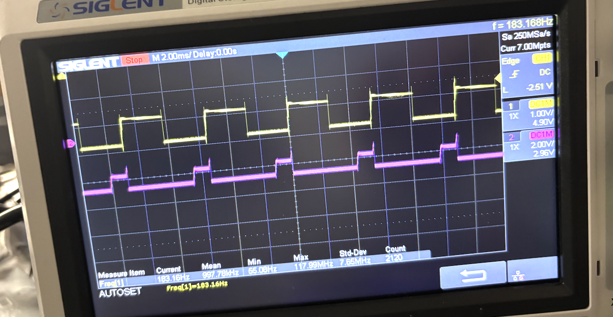
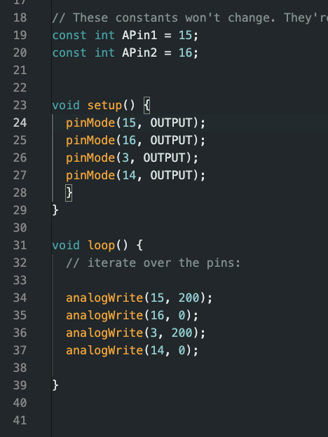
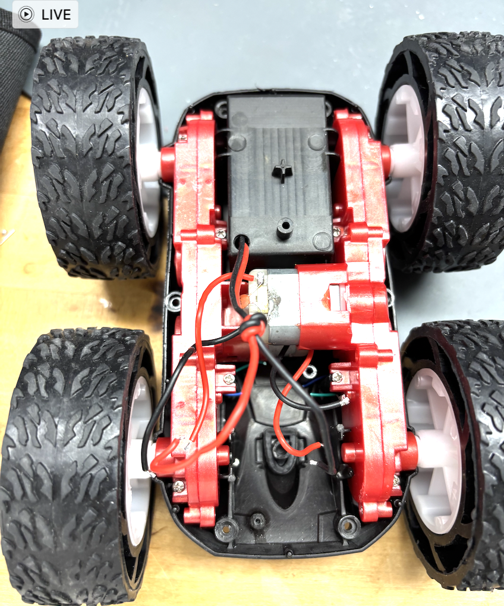
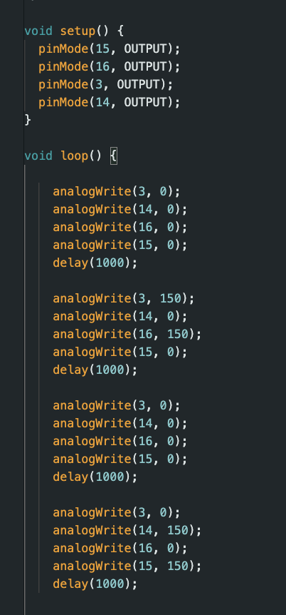
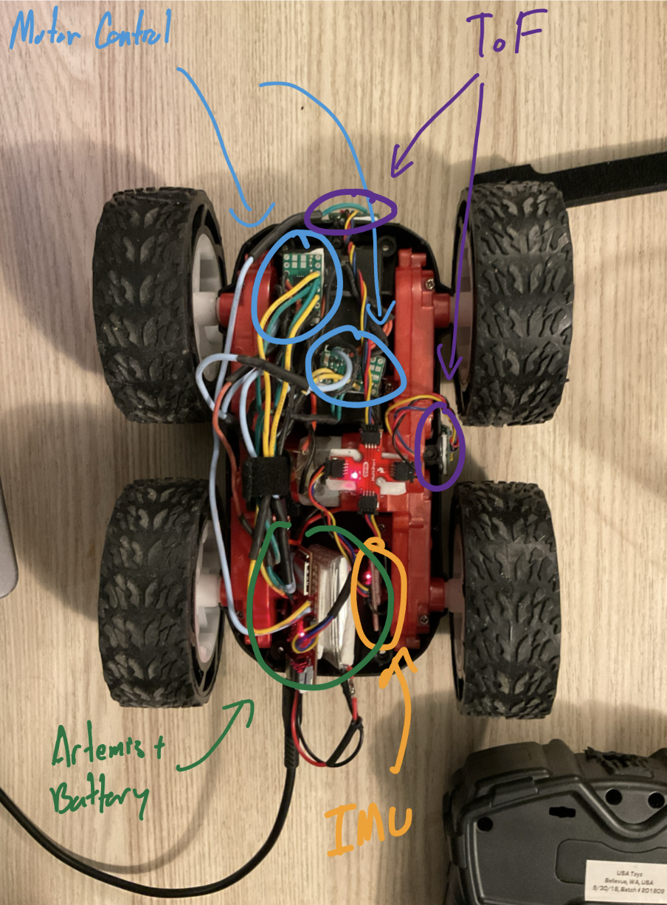
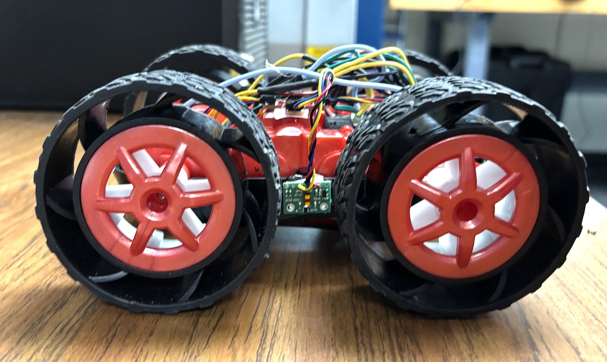
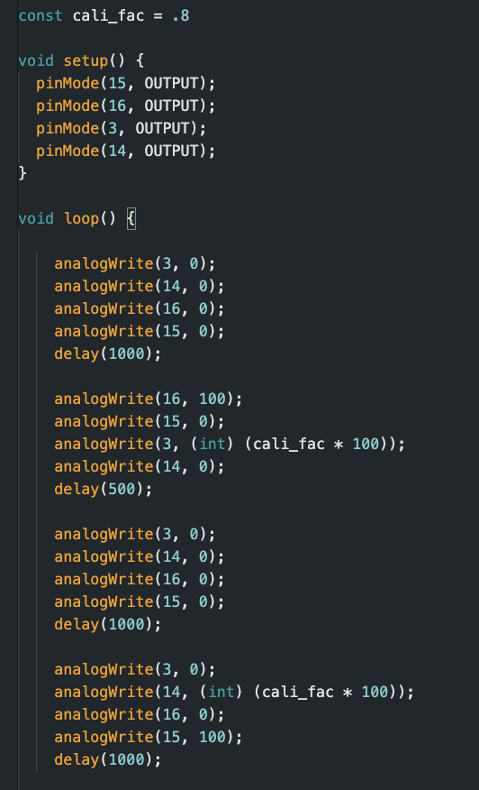
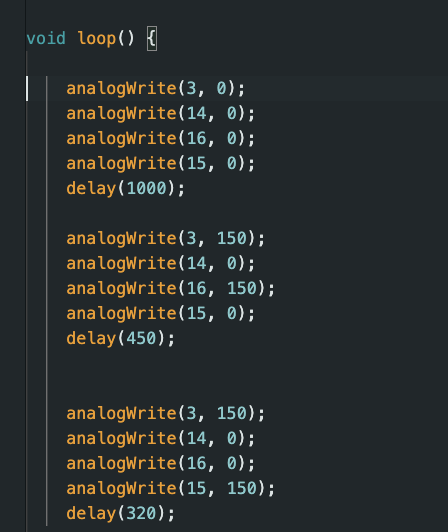

+++
title = "Lab 4"
description = "Fourth Lab - Motor Control"
date  = 2025-01-31
+++

> Lab1: Motor and Open Loop Control 

## Prelab
Before starting the lab we must refreshen up on how to use the oscilloscope and check out the documenation/datasheet for the dual motor driver. While also carefully considering how we would like to arrange our sensors in our car. Note that we use seperate batteries for the motors/artemis since the motors consume more power then the artemis. As well as that the artemis won't be affected by any noise by the motors. The pins I decided to use were analog pins 3, 14, 15, and 16 as shown in the diagram below how i connected them. 

# Tasks

# Lab 4

## **1. PWM Signals**

After soldering the motor controllers, befeore I attach them to the motors I tested them out first using an oscilliscope and power supply. To mimic what we will be using as power, I set the power-supply to 3.7 volts. Hooking up the Vin and GND to the power supply, and then Bout1/Aout1 to GND and Bout2 and Aout2 to prope we get these images on the oscilliscope: 

  

Running These Code: 

## **2. Take it APART!**

Now we must create an empty husk of the former car shown below: 

## **3. Spinning Motors**

Now we test if our motors function properly. I tested both motors at the same time with a power supply then only with a battery using 150 PWM on both. I tested it going forward and then going backwards as shown. Lifting the car on a small object so it didn't run away. 

Power Supply: 

Battery:

Code Used: 

## **4. Stuff It IN!**

Now we must stuff all the sensors we've been working on the previous labs inside the car. Now to make sure there wasn't to much wire loose I resoldered shorter connections and used hotglue/double side tape to fit everything in. Here the layout I choose to do: 

## **5. Lower Limit PWM **

Under load it took 60 PWM on both sides to get it moving. While testing it on a desk with a smoother surface then the ground the PWM actually was around 50 for both motors. Wihtout load it took 40 PWM to get it spinning. To pivot in place I made onen side 70 PWM to go right and the other 70 PWM to go left as shown below: 

## **5. Calliibration Factor **

Both motors sadly don't seem to spin at the same rate. However, they are close and to figure out which was stronger I set them equal and let it run. Whichever side turned the more I made weaker just by a little. My factor was 4/5 and can be seen below. After finding it I tested it by going forward then backwards 2m. It important to note that PWM by default is 8 bits (0-255) when configuring it, but it can be changed as shown in an example demo file. Meaning that at max it is 255 which we will later need think about in future labs.

## **5. Open Loop **

To put my car to the test I made it sping around my water bottle a couple of times: 

Here the code I used: 

