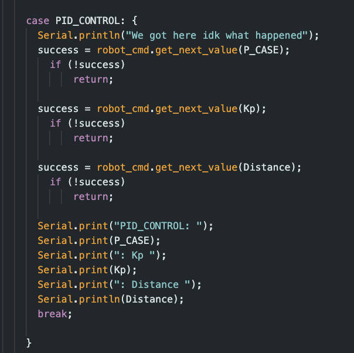
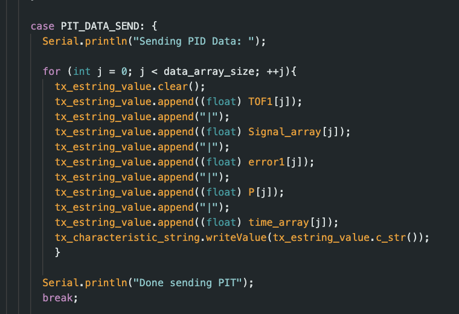
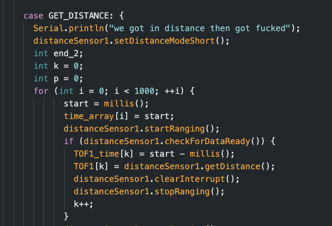
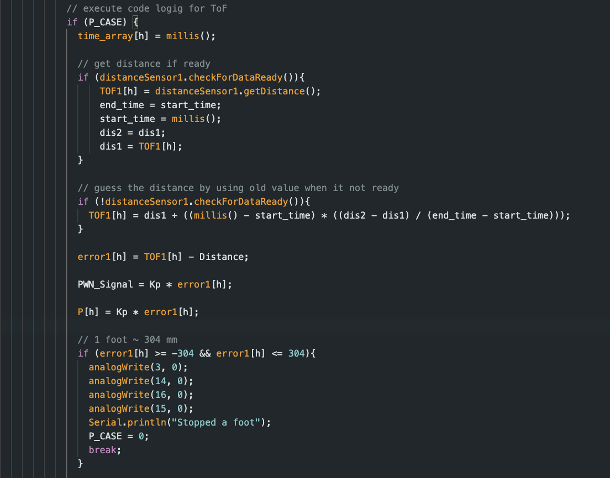
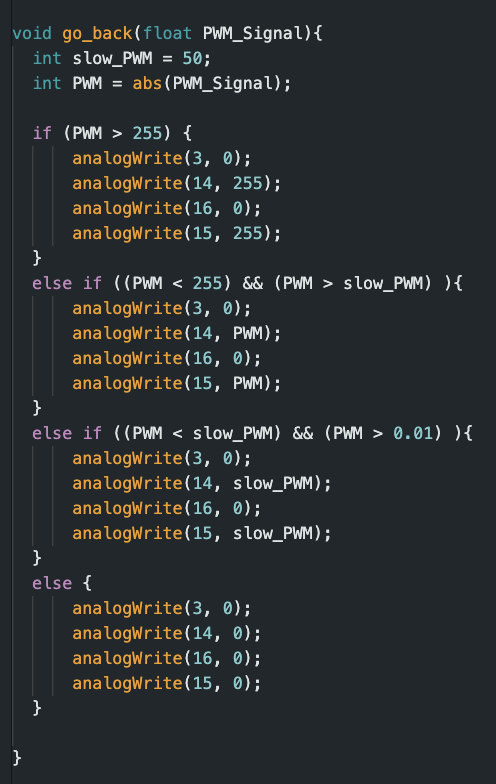

+++
title = "Lab 5"
description = "Fourth Lab - PID Control "
date  = 2025-01-31
+++

> Lab5: Linear PID control and Linear Interpolation 

## Prelab
The prelab put heavy emphasis on making sure we can debug properly. Having a base case of the robot turning off if disconnected is almost always necessary since otherwise it might roam around endlessly. While also keep in mind sending the debug information across bluetooth to figure out problems way easier. To send through bluetooth I based the PIT_CONTROl command on the send_three_floats from lab 1 as seen:

  

To send data I used a similar command again from lab 1; where we just send the chararcter arrays of our lists/strings collected. 

# Tasks

# Lab 5

## **1. PID Control**

At a 4000 lvl course I wanted to try out P first then later add on ID parts. Since P is the simplest, if I get that working integrating the other parts will help reduce steady-state and oscillations from occurings. It stops a bit short then expected, however this is most likeley because it only has data in the "present" to base of its infomration. 

The value that will be sent as PWM for the robot will be calculated simply as

PWM = Kp * error. 

Where error is the distance from the ToF - (target distance) in this case 1ft. The calculated PWM will regulate the robots speed, and slow it down as it approaches 1ft, where kp will be a constant. 

## **2. Position Control**

Using some commands from previous lab I was able to gather that the sampling time of ToF is 20hz (1/.05). However, this sampling rate will be much slower then what the PID control loop will run. When printing out statements it showcased a frequency of 225 Hz which is 10x as fast as what we need. Meaning that sometimes the distance used to calculate error won't be a live distance, but a approximations based off the previous. Knowing that the short sensor has a max range of 1300 mm we do: 

u(t) = K_p e(t)

\text{Maximum error} = 1300\text{ mm} - 304\text{ mm} = 996\text{ mm}
255 = K_p \times 996
K_p \approx 0.256

Meaning that we can use .256 as a balanced kp value that will use almost max power at max range giving good control and speed. However, while experminting I opted to use .1 to have better control of its stopping distance and power control over motors. 

## **3. PID Implemenation**

Now as mentioned before the ToF won't always be able to provide data for us to calculate error. Knowing this we use the last 2 data points slope, and using the change of time between them we can get a estimation of where the car is as shown below. This value, adn the ToF reading will be appeneding to the same array meaning that both values will always be avaiable for doing this calculation. 

With these calcuations, we get a PWM signal produced with the kp and error. Depending on what this PWM signal will indicate wether the robot should slow down, speed up, go forward, or go backwards which the logic behind that is shown below. As mentioned in a previous lab, 255 is max and if we get a PWM signal that greater we automatically set it as 255 to the robot. Otherwise we make sure the PWM signal doesn't go below 50 otherwise we won't have enough power to move. Lastly, if PWM does become 0 then that means we reached the desired distance. 

  

Here is a video of it using the P algorithim to stop ~ a 1ft away from the wall. 

