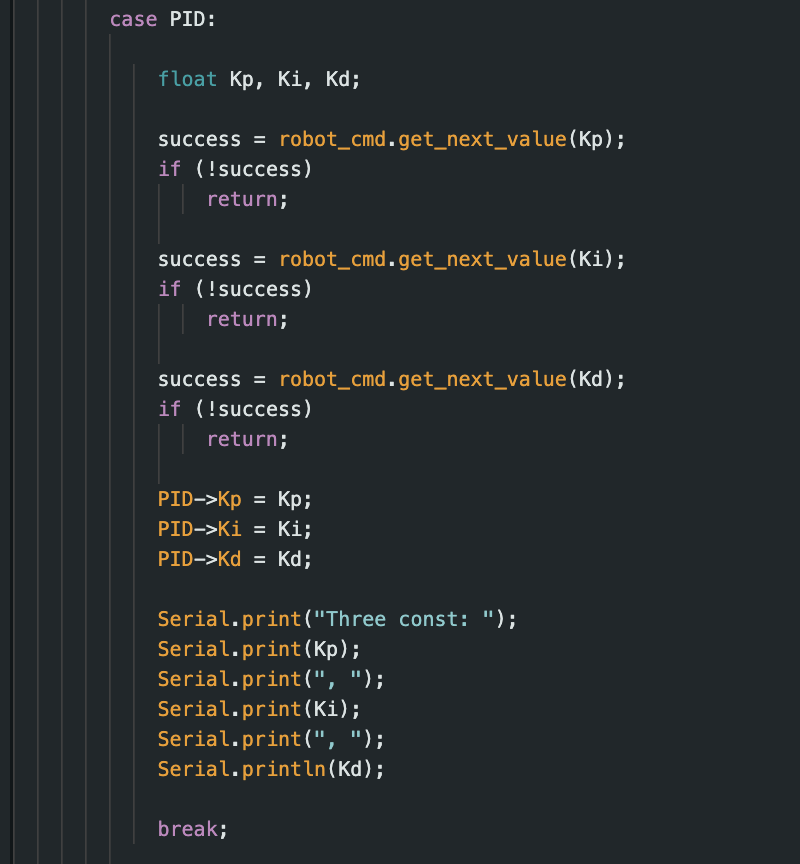
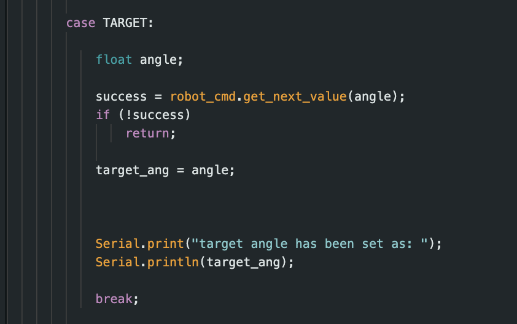
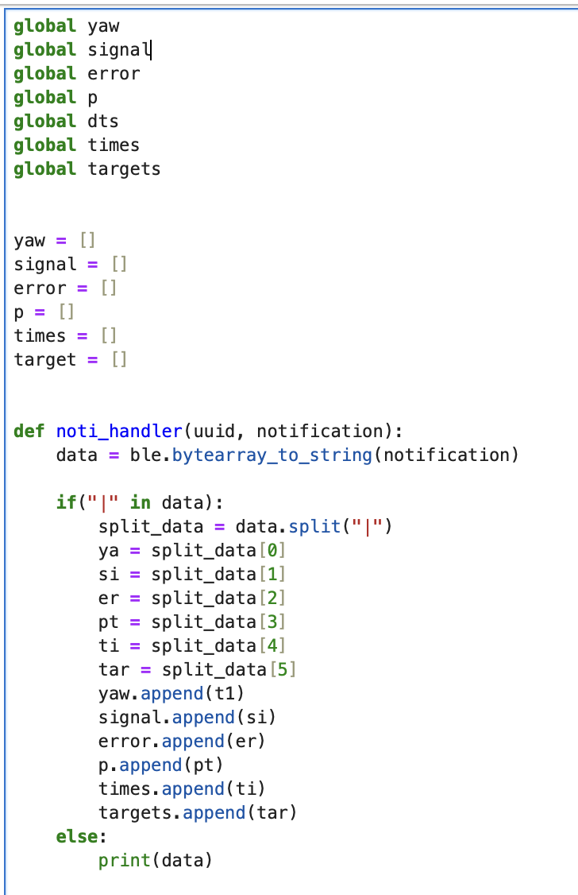
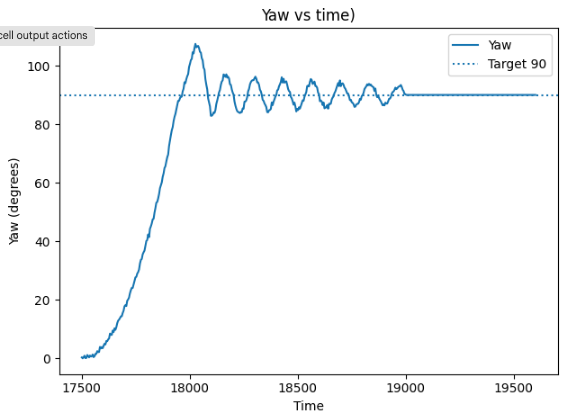
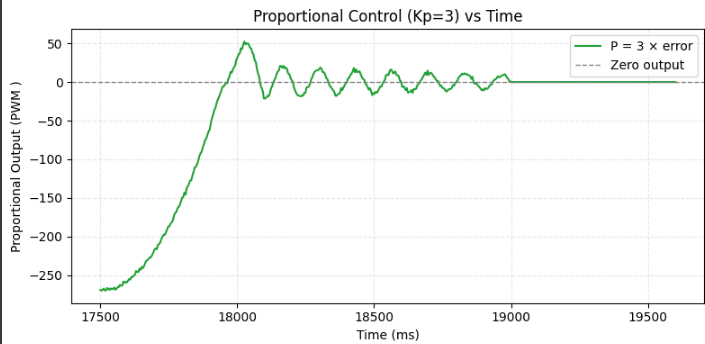
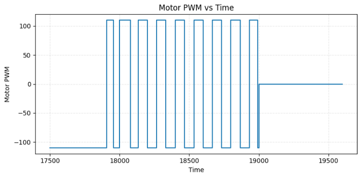
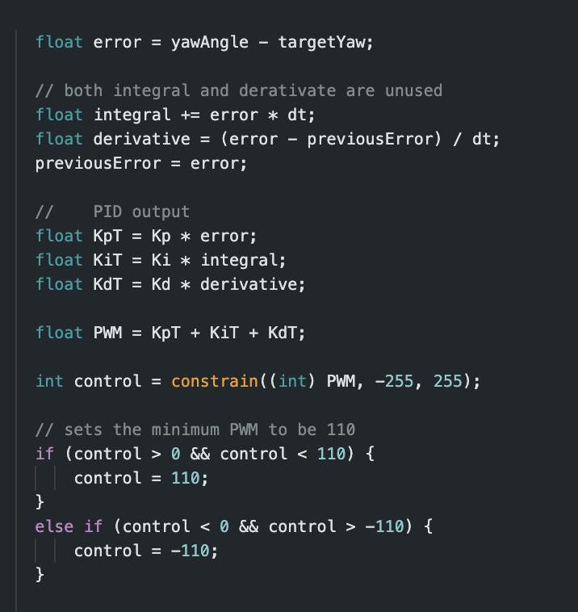
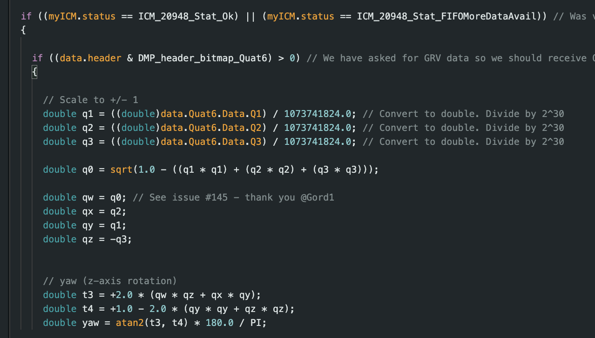

+++
title = "Lab 6"
description = "Kalman Filter"
date  = 2025-03-24 
+++

> Lab6 : Orientation Control 


# Tasks

# Lab 6

## PRELAB **

  Before getting to the main programming part of the lab we had to ensure some bluetooth commands were ready that can be used for this lab and future labs. Like previously a command to tune the kp, ki, kd term is still present allowing us to recalibrate not just for this lab but also for future labs. Furthermore, we have a command that allows you to set the target of the orientatoin, which at first I implemented it both as a orientation and distance changing command. However, I decided to seperate it to make controlling what I want to do with the car more direct. Allowing me to change the orientation of the car while its moving forward, for example If i wanted to make a sharp turn to do a drift or stunt. While also having the command to change the target will prove useufl in future labs, if I need to change the angle the robot is facing such that it spins a 360. However, this can manually turn the car through python, if we want it to automatically do a 360 at a set amount of turns c implemenation needs to be configured. However, if we manually want to turn at certain degrees for naviation that does prove useful. A fun note to add is that I added a timeout at the bottom of the code, such that the robot gets out of control after a few seconds it will shut off. Allowing me not to chase my robot around.

 
 

This is also the notification handler I used for this lab to gather the target, orienation angle, time, pwm, and error. Using the same command as previous lab PIT_DATA_SEND. 

```python

ble.send_command(CMD.PID, "4 " ) 
ble.send_command(CMD.PID_CONTROL, "1 | 0.1 | 0 | 304.0" ) 
ble.send_command(CMD.PIT_DATA_SEND, "" )

```


## PID Control **

Similar to the previous lab, we used that code as a baseline. With PID, P being proprtional for the present state of the robot which can be calculated simply from calculating the error (target - current angle), I being the integral which acounts for steady state error produced (past). Lastly the D term which is the deferential term that accomadtes from when PI overshoots by multipling the rate of change in error with the constant kd. 


[](https://youtu.be/i1Tq-JVp6ws)

As you can see the car is able to oriente itself to its set target angle (90) each time even though offsetting it with my foot. In this implemenation I only used Kp (no kd or ki) since it was more straight forward and easier to use. However, in my code I do have terms for ki and kd if I decide to use them in future labs in order to get a more precise (faster) orientation. Even though I didn't work with the ingtegral and derative terms, working on other projects with PID there are some considerations if I wanted to use them for future labs. For example the integral term will continosuly increase (drift like the gyroscope) and needs to be clamped out from going to an extremely high value if left running. Furtheromre the d term can be impacted a lot by noise, which discussed in lecture can be mitigated by providng a low pass filter thoruhg it which isn't to bad to code as seen by previous labs. This noise is impactful since d is suppose accomadte for PI, and with high frequencies can greatly affect its stability and control behavior. The kp value I selected was based off last lab and the PWM value I used for this lab. In order for the robot not to spin out, I choose a small PWM value of 110. From this PWM value iI was able to select what kp term by simply adjusting from the a small value of .25, and steadily increasing it until it worked around the kp value of 3 as mentioned from lecture to do. I clamped the PWM value to be 110 since this was the minimum amouunt required for it to rotate around. Meaning if the PWM calculated from the PID was less then 110 then it would ramp up to it.  


 
 


These are the graphs that I gathered when running a target value of 90 degrees. As you can see here the P graph looks very similar to the yaw graph since this graph is essentially just the yaw graph scaled but through the error. Which is why the PID value is much greater at the begging since it is scaled from 90-0 * 3 which is about 270 which looks about right in the graph. Next the yaw graph showcases a sinsuidial behavior, which matches what is seen in the video. The video showcases how the robot will oscillate from the target angle overshooting and undershooting until it stops which matches what the yaw graph gathered. Lastly the PWM, as mentioned before I clamped the PWM value to be 110 no matter what which can be seen here. Overlaying the graphs you can see it matching the concavities of the the yaw graph which makes since, this is what leads to it calculating the PID values. 

 


## DMP **

What we used for yaw in previous labs was data gathered directly from the gyroscope with yaw_g = yaw_g = myICM.gyrZ()*dt. However as seen in previous labs the gyroscope accumaltes a lot of drift, which adds up after some time. We tried to offset this drift that occurs by using sensor fusion combining the accelerometer and the gryoscope and intrigating a complementrary filter. Even though this does indeed help mitagate the drift that is seen by the gryoscope there is still noise and drift that accualtes after time nonetheless. Other limiations the IMU has is that it has a maximim rotational velcoity of 2000 degrees/s (other configurations of 250/500/1000 as well). Meaning that if the robot is spinning (rotating) to fast it will provide false values, which will then give pad PID values. Due to this instead we incoprated the IMU DMP to calculate yaw. The DMP provides run time and background calibration for the accelerometer, magnetometer and gyroscope, which provides optimal sensor data through senesor fusion. Allowing it to correct for errors and drift especially with it use of an additonal sensor. However by defualt it is deisabled since it does take up 14 kB of addiontal space, but we don't care what the space used in our coe. To use the DMP following the tutorial on the lab page we exported the exmaple7 and added to our code as showcased below. 


 


Since we only want yaw, I deleted the other 2 measurements of angle and implemented only what is showcased above. Fun fact about DMP is that it implements a FIFO which causes it to read to slowly. To mitagate this issue we slowed down the output rate such that the arttmis control loop will run faster then what the DMP generates. Using DMP vastly changed the accuracy of what is recieved as a YAW angle, however, at first it does cause some of my arrays to be maxed out, leading to some memory leaks which was then resolved as mentioend early. 

```c

success &= (myICM.setDMPODRrate(DMP_ODR_Reg_Quat6, 0) == ICM_20948_Stat_Ok); 

```

All in all this lab, provided great insight on how robots are able to orientate and the different way of calculting the orientaiton angle. In the first labs we mitages the error seen by sensors by using filters, but now are using a DMP to calculate yaw. However, I do wonder since now we are using a magnotemeter if that will have any impact in the calucated angle if the magnetic field comes into play. However, that question is for futre labs. 


