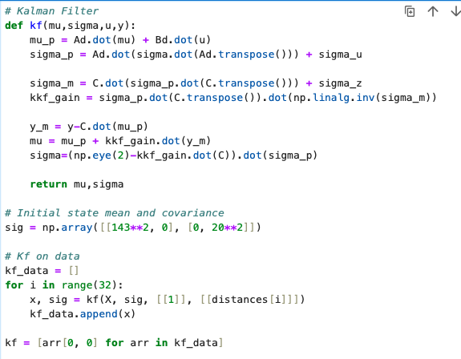

+++
title = "Lab 7"
description = "Kalman Filter"
date  = 2025-03-24 (Birthday :D)
+++

> Lab7 : Kalman Filter Implementation

# Tasks

# Lab 7 

## **1. Estimating Drag and Momentum **

  To build the state space model we need to calculate drag and momentum terms for the A and B matrices. First we must choose a step resone (PWM Value) to run the car at.  I chose a PWM of 124

 
 

These are the associated speed, position, and PWM graphs I got from my car. 

With these values collected I calculated the drag and momentum using these formulas from lecture.

  

Implementing it in Python: 

  

To calculate these values I needed to get a steady state value for my speed. I used 1st order system formula from lecture 14 slides: 

To get a value of 2133 mm/s. which for 90% will get you 1919.7 mm/s. For the dt I calculated by finding the avgerage sampling rate of all the collected values which turned out to be .009 seconds. 

## **2. Initializing KF **

 

 

Following the formulas from the same lecture we use the momentum and drag values we calculated to get arrays A and B. Keeping in mind that dt is our sampling rate from earlier.

C is an m x n matrix where n are the dimenstion in the state space and m are the # of states. For this we set it as [1,0] since we are measuring positive distance from the wall (state 0)

 

Next we have to intialize the state vector. The first position is the first reading from the TOF at rest. The velocity is set to 0 since the car isn't moving. 

  

Following that we now need to calculate our sigma z and u matrixes. To do this we need to find the standard deviation of our measurment and process noise. Sigma 3 is set at 20 mm to match the ranging error of long distance mode which was used to collect data for the ToF. 

For sigma 1 and sigma 2 used the formula $\sqrt{u * (1/dt) }$ where u in our case will be the mean value of 10. This gave us a sigma of ~33 mm/s where sigma 1 correlates with the trusted model position and sigma 2 is speed. 

## **3. Kalman Filter in Jupyter**

Next was implementing the filter in jupyter notebook. To do this I based my code from the provided code in lecture, and set an intial sigma with similar paramters to before. However, this time I set the sigma1 to a value of 143mm/s since this was the value i calculated when I took the std of my velocity. I wanted to get a more precise value for this case to see if it'll line up more. This is the resulting graph of it. The other graph where the end values don't match up as nice is the result of me using a insital sigma of 20. This change in value led to a significant change in graph especially since when squared 400 << 20,000.

I wanted to experiment with different dt values, and to do so I simply tested it by adding serial print statments to slow down the ToF. 

Running the KF filter with base paramters as before actually gave pretty code results even with a lower dt. Dt directly changes the Ad array, the momentum calcualtion, and sigma values used for these matrixes, hwoever, as long as you configure it right it can accurately display the stead state in the system. The above image is showcasing a dt of .223 which is ~2.4 times slower then the original of .09. 

Here is a video of it using the P algorithim to stop ~ a 1ft away from the wall. 

