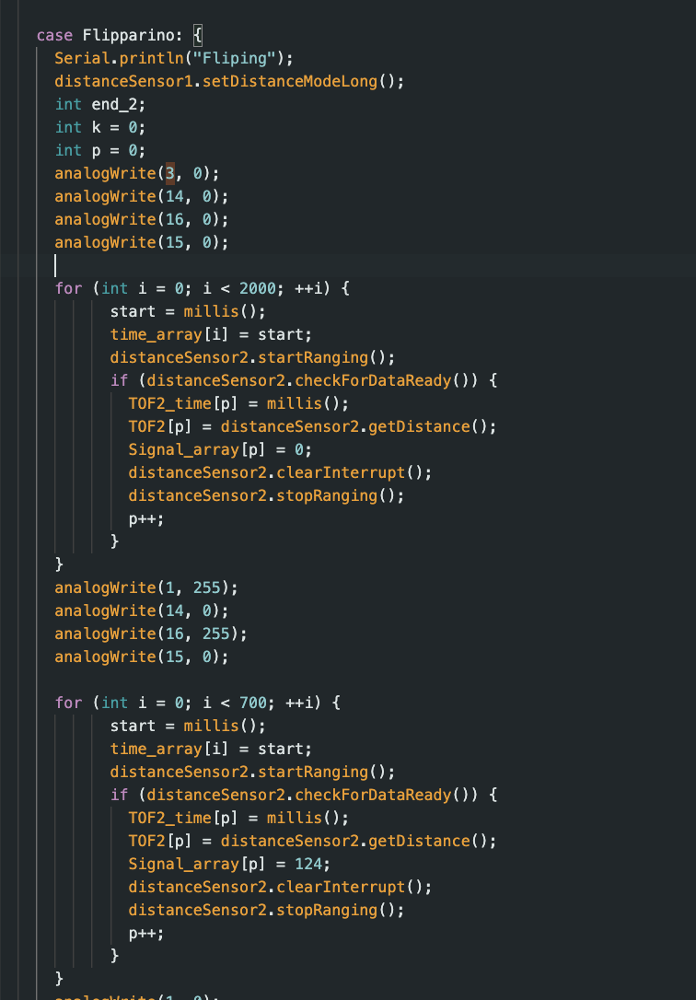
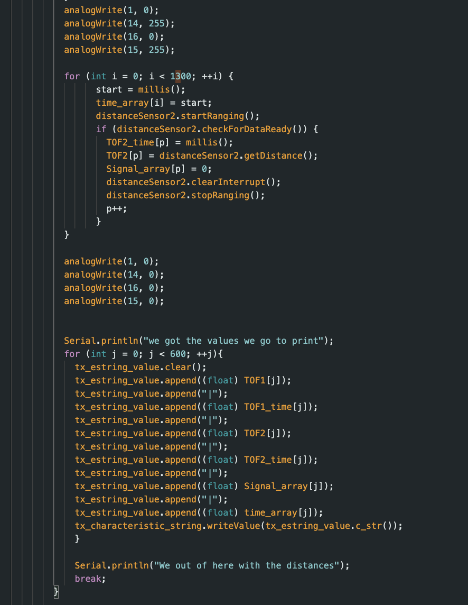
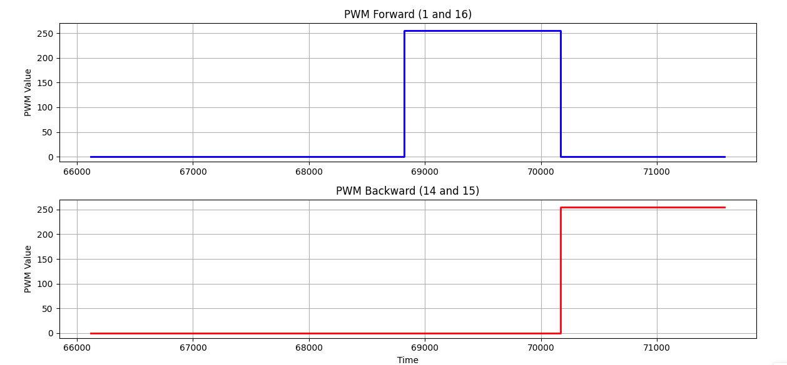
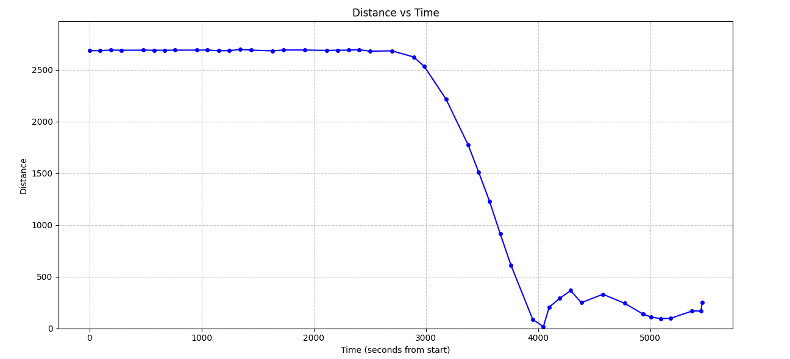
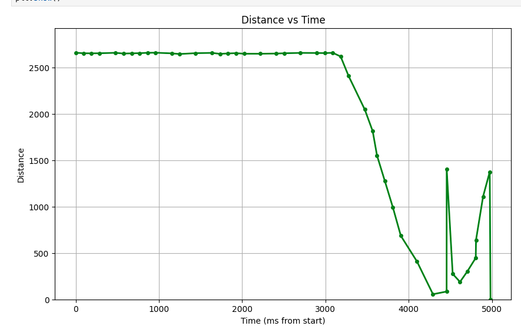
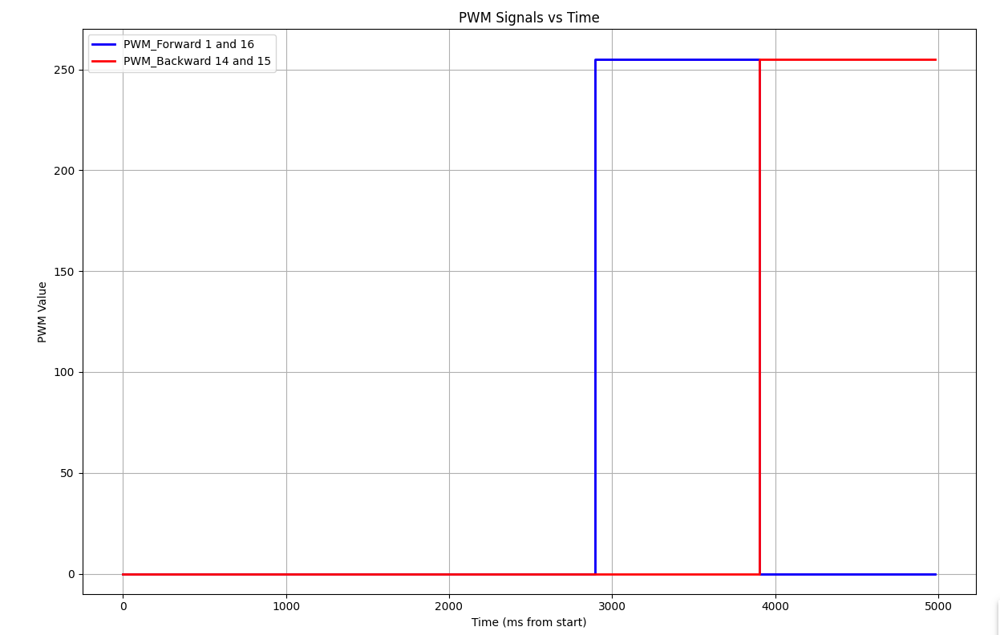
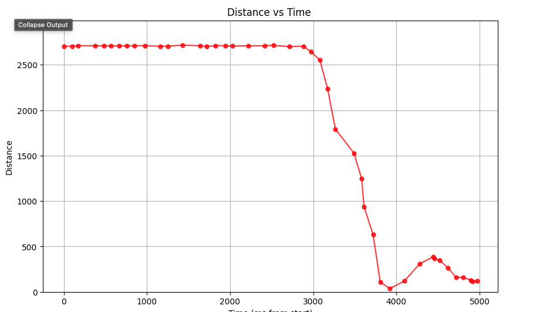
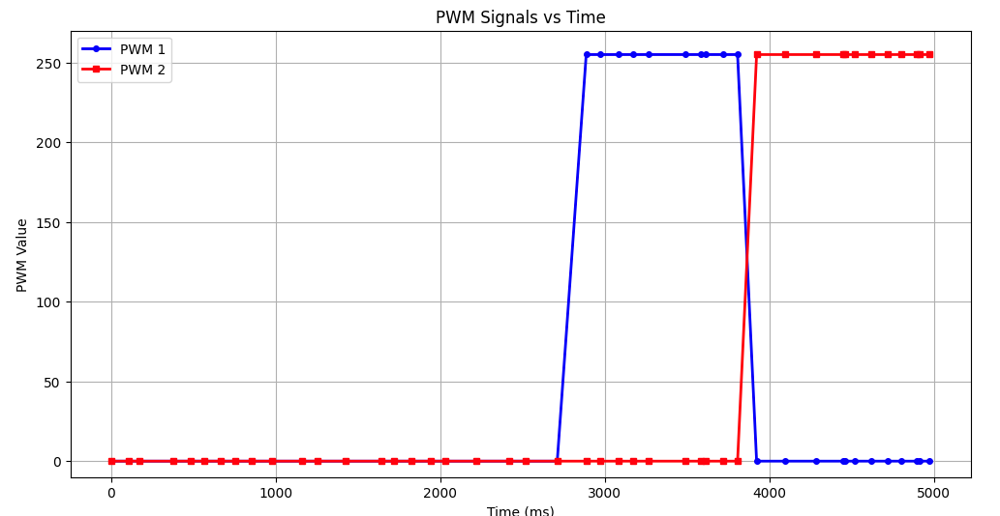

+++
title = "Lab 8"
description = "Stunts"
date  = 2025-04-8 
+++

> Lab8 : Flipparino 

# Tasks

# Lab 8 

## **A. Flipparino Code**

The task I decided to do was flipping my robot, little homie, and driving it backwards over where it started. To implement this I simply hardcoded everything. No PID or Klarman filter was used I simply sent my robot forward and then backwards as shown in the code below. 

 

Here at the begging of my code I made by robot collect some data for a few seconds before operating by making sure the PWM was set at 0. After a few seconds I made it go full throttle to the wall at 255 PWM even though I know the max is around 180 I just maxed it out on both pins just to be safe. In order to actually flip the robot I simply made it go backwards full throttle at 255 PWM as well. At first I had it stop to try to flip it however, it wouldn't just turn off the motor immediately causing it to drift a bit. To stop this issue, I simply removed it stopping instead it transitioned immediately to reverseing which worked out much better as seen by the videos. 

## **B. Flipping Robot Adjustments **

Having the code was the simple part the most difficult part was making sure the robot had the physical criteria to flip each time I ran it. 

 

At first I was testing out drifting and tapped all my wheels in order for there to be less friction created, allowing it to drift easier. However, when I decided to go to flipping instead initally I left the tape on all the wheels. However, this caused issues since the car never was able to create enough momentum in order flip properly. This was due to the front wheels not gaining enough traction to allow for the back wheels to simply flip over even with added weights. To resolve this I simply removed the front wheel tapes, but left the back wheels tape in order for it to be easier for it to flip. With the wheels on the back with tape this meant that it would have less traction and static friction that needed to be overcome to allow it to flip which worked really well for flipping. 

In addition to this I added weights inside the battery comparment of my robot. The weights I decided to use were 3 pebbles that I found that fit perfectly inside. These 3 pebbles helped anchor the front wheels when it transtions from forawrd to backward allowing it to pivot the back wheels to do a complete 180. 

Lastly, the biggest factor that I found was friction! Throughout testing I saw that my car intially flipped at my first runs but then suddenly seemed to lose all momentum and stayed on the ground. I realized that the front wheels were collecting so much floor dust that it lost all its traction! This meant that it wasn't able to hold its position and flip properly, meaning for every trial ran I wanted to test I manually grabbed a gloth soaked it and cleaned the front wheels to make sure they had enough grip!

## **C. Data Collection and Stunts**

All the data was collected while running. Some of the ToF data measured was off a bit since one trial the robot has a bit of a skew when returning pack. The PWM graphs are practically the same since at all times it was running at full throttle just at different pins which are showcased. The robot was started at 100 inches from the wall which can bee seen in all the data collected with its intial ~2661 mm data points at the beginning. Then it flipping at aroun 17 mm, then going fully reverse. Since reverse it was the reamining of the room the total isn't 100% accurate since now the ToF is reading away from the wall and then getting picked up or running into a chair. The sticky pad was use a reference guide to determine where the robot should flip at around 17 mm as mentioned before. 

### Trial 1

 

This was by far the fastest trial with 2.28 seconds from start to back!

### Trial 2

 

Since this trial it kinda hit a chair the leg while reading and end the ToF data is kinda sparatic as seen by the graph. This one was around 2.4 s

### Trial 3

 

Lastly my last trial probaly my most stable as well with 2.43 seconds clocked in. 