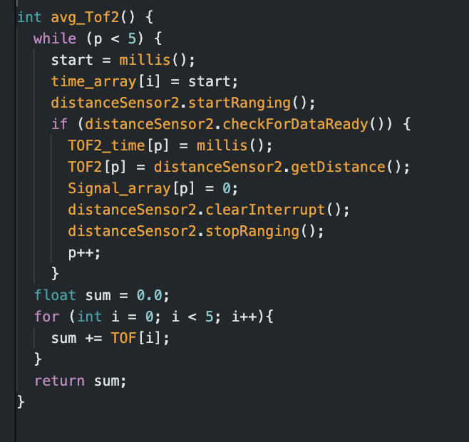
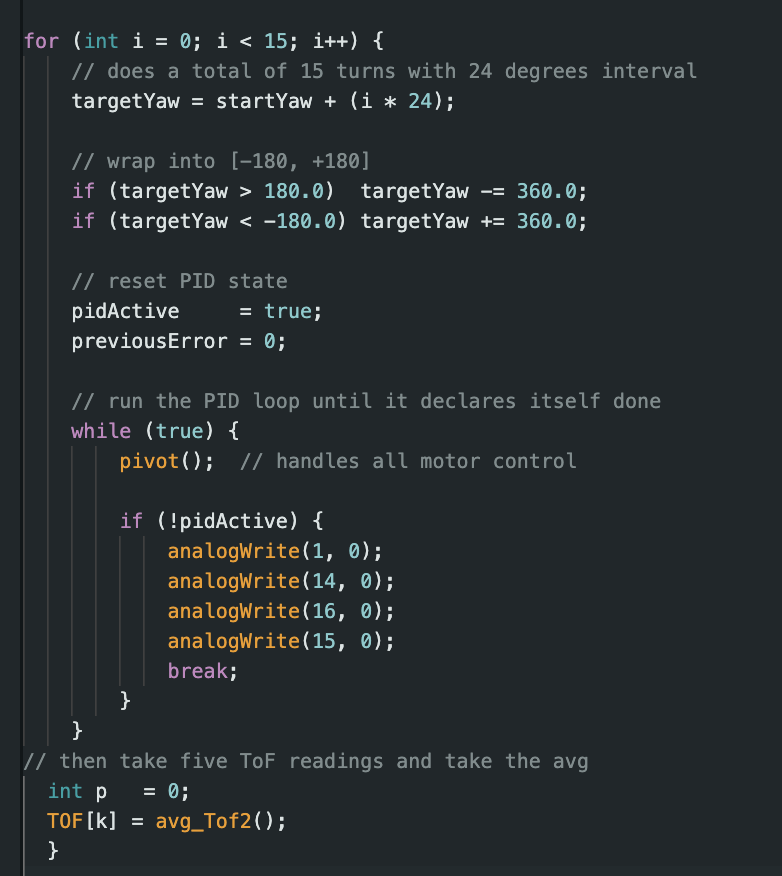
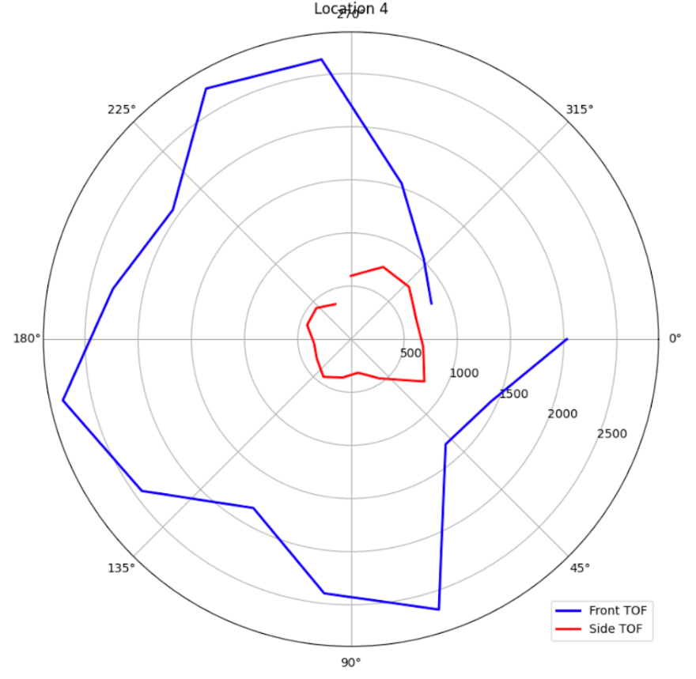
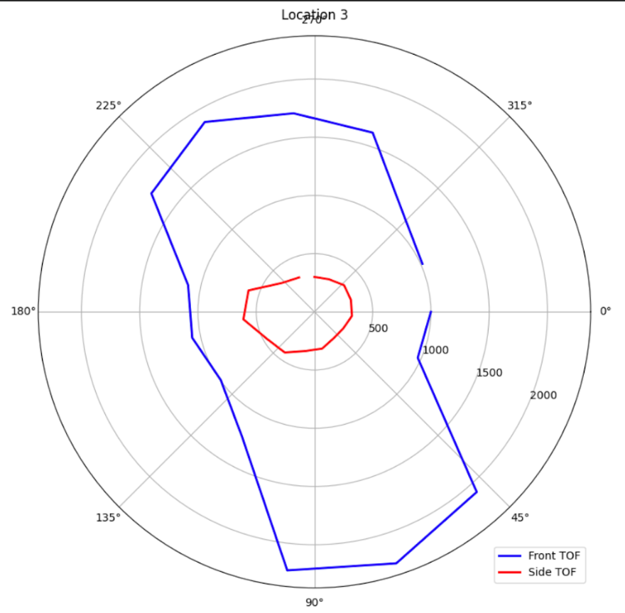
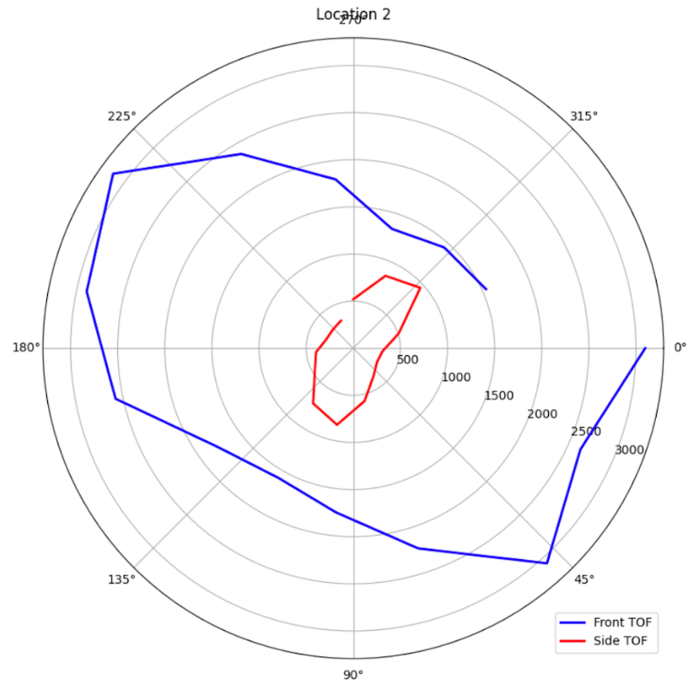
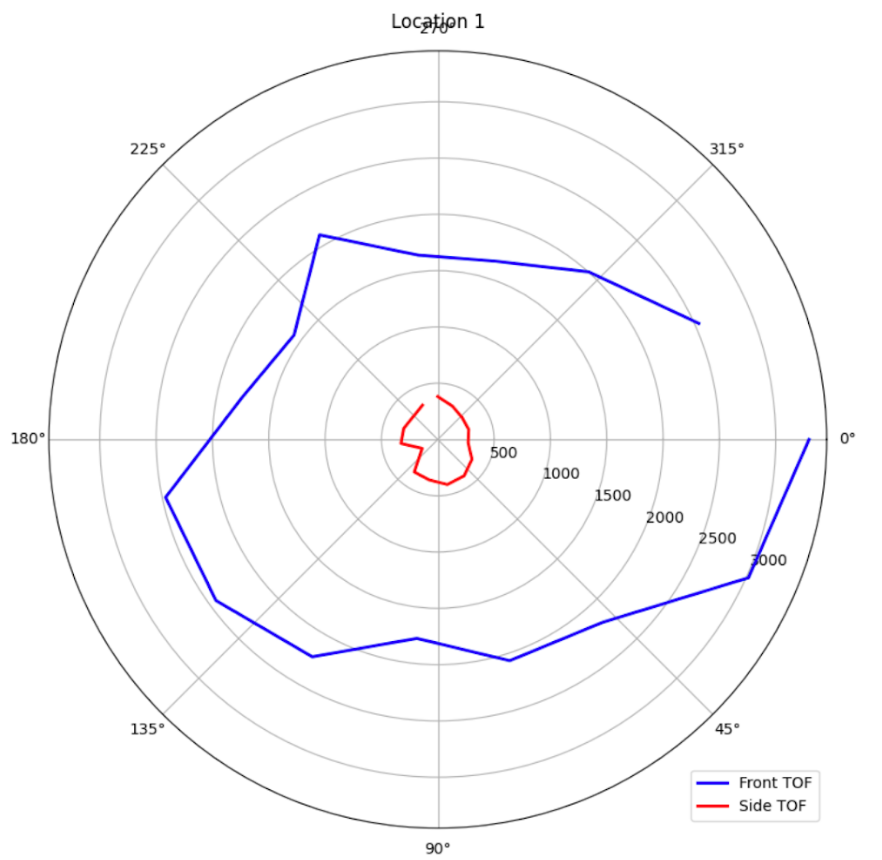
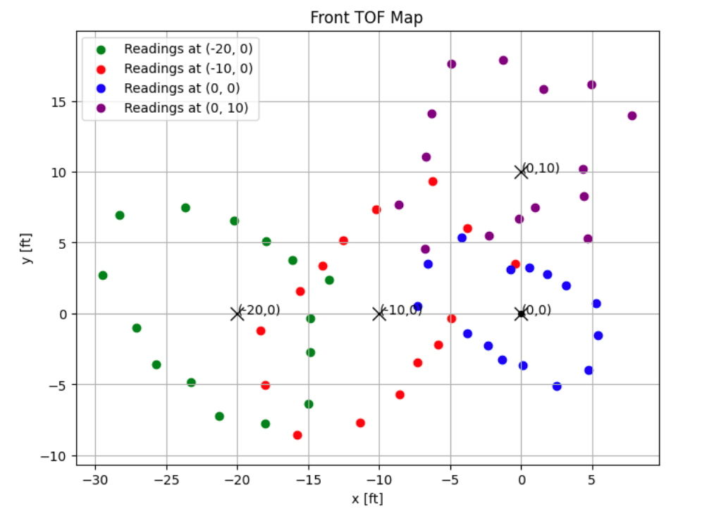

+++
title = "Lab 6"
description = "Mapping"
date  = 2025-04-24 
+++

> Lab 9 : Mapping

# Tasks

# Lab 9

## PRELAB **

The purpose of this lab is to map a static room using our robot. The design of this lab is to place our robots at set locations and make it able to map its environemnt by using our orientation control from lab 6 to spin it around its axis. While it spins around at each angle that we set it to it should collect a distances to the wall. In this lab I dieced to to PID control using the code we implemented in lab 6. Using our knowledge of transformation matrixes in order to plot our readings and draw them on our map. Keep in mind the transformation matrix is made from rotaiton matrix + translation + scaling matrix however we won't be using the scaling matrix in this lab.

## PID Control **

Similar to lab 6 we will be able to assign our robot certain angles for it in order to rotate the desired amount of times. Even though the lab asks us to rotate for 14 distinct degrees, I decided to use 15 since this was easier to do caculations for in our code since each turn would only be 24 degrees. While doing this lab, an error would occur 

Here a video of the car mapping out a hallway on the third floor of Rhodes. Due to the fact that I worked after office hours, I was unable to get my mapping configuration working in time to actual map out the lab. However, I was able to get a good mapping at one of the intersection corners of rhodes hall. 

   

This is the code that I used that performed a for loop to get all 15 increments in degrees that angle gets added +24 each run. Each angle is then plugged into our PID control fucntion that we created in lab 6 called pivot() in this case. Using the PID from lab 6 measn that we mitiage any drift and error casued from the gyroscope when calcuting degree orientation since I used DMP. The only other issue that occured sometimes was false ToF reading where it would be off by a few mm. To account for that as per the lab we took the avg of 5 ToF reading per increment and appended that to the array that we returned. One of the ToF was pointing downwards, however, it data wasn't necessary to complete this lab but it data was still plotted as can be seen in the 4 polar graphs. 

   
   

An important factor in getting the car to spin accruately was something I learned from lab 8 was tape the wheels to create less friction so PID had better control. As well as that this time we don't want to wipe our wheels off the dust that gets accumlated. However, at times the car would drift in place and shift either verticallly/horitontally however it was very minor. 

To perform the transformation matrix I based my code from the example provided from transforms.offset_copy. As shown below I applied it to my code chagning it up to as follows: 

As you can see the rotation and translation matrix is known, all we had to do is convert from our polar coordinates into cartesian. Simplyt doing x = rcos(theta) and y = r*sin(theta). Then afterwards we converted these local cordiantes into global coordiantes. Then afterwrads we had to convert the distances from mm to feet, by dividing it by 304.8. Once all these calculations were down the homogenous tranformation was able to keep us the recontructored map as follows. The X's represent the 4 locations I placed the robot in order to map it approprieatly. 

Filling out the boundires for this map, we get the following final lined up map as shown below. This is pretty accurate to the hallway in rhodes hall even though there is a slight overlap at the bottom left. This is most liekly just based off the reference of where the robot is and, most likely if I skewed it to the left more it wouldl more line up to appear as the corner as it is iin real life. 

Here are the coordiantes for each of the lines that were drawn out for the hallway. It is fairly accurate as mentioned before, however there are pointsn where the hallways extend out further. Which likely is from the sensor maxing out since it can't read that far for data. Which is why I didn't highlight those points, because the robot is interpreting them as fall walls. 

## References **

In this lab I got aided by Sana, Lulu, and Jennie 

